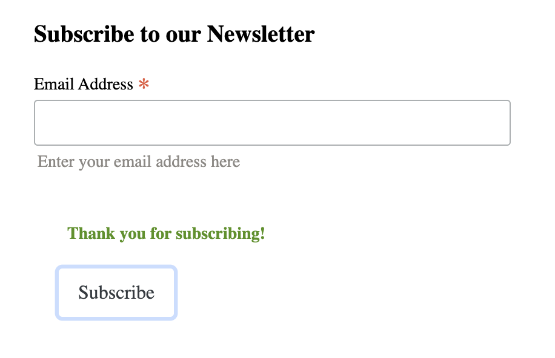

# Features

## Access to pages according to the user role:

| Page Name | Logged out  | Customers  | Admin |
| --------- | ----------- | ---------- | ----- |
| Home       | Yes         | Yes        | Yes   |
| Login      | Yes         | Yes        | Yes   |
| Register   | Yes         | Yes        | Yes   |
| Logout     | Yes         | Yes        | Yes   |
| Store Products   | Yes         | Yes        | Yes   |
| Store Product's Details | Yes         | Yes        | Yes   |
| Bag       | Yes         | Yes        | Yes   |
| Profile   | No         | Yes        | Yes   |
| Edit profile   | No         | Yes        | Yes   |
| Add address   | No         | Yes        | Yes   |
| Edit address   | No         | Yes        | Yes   |
| My Orders   | No         | Yes        | Yes   |
| My Order's Details   | No         | Yes        | Yes   |
| My Wishlist   | No         | Yes        | Yes   |
| Checkout   | Yes         | Yes        | Yes   |
| Create newsletter-promo Email | No         | No         | Yes   |
| Delete product's type | No         | No         | Yes   |
| Add product | No         | No         | Yes   |
| Edit product | No         | No         | Yes   |
| Delete product | No         | No         | Yes   |
| Personnel Product's full details | No         | No         | Yes   |
| Add new image modal | No         | No         | Yes   |
| Edit image modal | No         | No         | Yes   |
| Delete image modal | No         | No         | Yes   |
| Orders | No         | No         | Yes   |
| Order's details | No         | No         | Yes   |

## Main Features:

- Each page has a navbar and a footer

## My Gallery
| Feature | Screenshot | Description |
|---------|-----------|-------------|
| **Homepage** |  | The homepage introduces users to the store with a visually appealing banner showcasing new tattoo designs, encouraging engagement and exploration. |
| **Product Browsing** |  | Displays available tattoo designs with pricing, ratings, and quick add options, making shopping more efficient. |
| **Product Details** |  | Provides an in-depth view of the tattoo, including pricing, description, and an easy-to-use quantity selector for a seamless shopping experience. |
| **Add to Bag** |  | Users can adjust quantities and proceed to checkout with clear call-to-action buttons. |
| **Shopping Bag** |  | Displays selected items with a straightforward checkout button, ensuring a smooth purchasing process. |
| **Bag Information** |  | Shows a detailed view of items in the bag, allowing users to review and modify their selection before proceeding. |
| **Checkout Page** |  | Allows users to enter shipping and payment details with a secure transaction process. |
| **Order Confirmation** |  | Confirms order placement with a summary of purchased items and delivery details, giving users confidence in their transaction. |
| **User Registration** |  | Ensures secure account creation with email verification to prevent fraudulent sign-ups. |
| **Email Already Registered** |  | Prevents duplicate sign-ups by notifying users when an account already exists with the given email. |
| **Sign In & Sign Out** |     | Secure login and logout functionalities with success toasts providing user feedback. |
| **Sign In Success Toast** |  | Confirmation popup for successful login, enhancing user experience. |
| **Sign Out Success Toast** |  | Provides user feedback upon successful logout. |
| **Profile Management** |  | Users can manage personal details, delivery addresses, and view their order history in one place. |
| **Wishlist (Liked Items)** |  | Users can save their favourite tattoo designs for easy access later, improving browsing efficiency. |
| **Product Management (Admin)** |     | Admin users can add, edit, or remove products, ensuring inventory is up to date. |
| **Authentication for Product Management** |     | Restricts editing and managing products to authenticated users only. |
| **Search Bar** |  | Users can quickly find specific tattoo designs, improving navigation and product discovery. |
| **Newsletter Signup** |     | Users can subscribe for updates, promotions, and new tattoo releases, enhancing engagement. |
| **Footer & Social Media Links** |     | Provides quick access to social media pages, allowing users to stay connected with the brand. |
| **Contact Us Page** |  | A simple and user-friendly form for customers to reach out with inquiries. |
| **Response to Contact Form** |  | Confirmation message ensuring users that their query has been received. |
| **Verification Email Sent** |  | Notifies users to verify their email after registration, enhancing security. |
| **What Comes in the Bag** |  | Provides clarity on what users receive with their purchase. |
| **Stripe Payment Checkout** |  | Secure payment processing using Stripe, ensuring a smooth transaction experience. |
