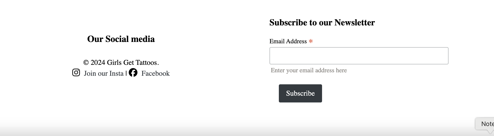
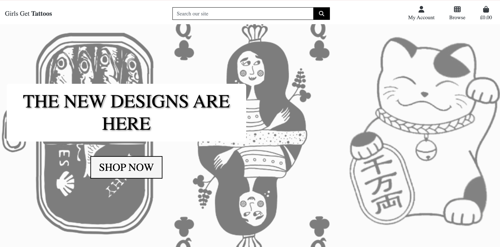

# Features

## Access to pages according to the user role:

| Page Name | Logged out  | Customers  | Manager | Admin |
| --------- | ----------- | ---------- | ------- | ----- |
| Home       | Yes         | Yes        | Yes     | Yes   |
| Login      | Yes         | Yes        | Yes     | Yes   |
| Register   | Yes         | Yes        | Yes     | Yes   |
| Logout     | Yes         | Yes        | Yes     | Yes   |
| Store Products   | Yes         | Yes        | Yes     | Yes   |
| Store Product's Details | Yes         | Yes        | Yes     | Yes   |
| Bag       | No         | Yes        | Yes     | Yes   |
| Profile   | No         | Yes        | Yes     | Yes   |
| Edit profile   | No         | Yes        | Yes     | Yes   |
| Add address   | No         | Yes        | Yes     | Yes   |
| Edit address   | No         | Yes        | Yes     | Yes   |
| My Orders   | No         | Yes        | Yes     | Yes   |
| My Order's Details   | No         | Yes        | Yes     | Yes   |
| My Wishlist   | No         | Yes        | Yes     | Yes   |
| Checkout   | No         | Yes        | Yes     | Yes   |
| Create newsletter-promo Email | No         | No         | Yes     | Yes   |
| Delete product's type | No         | No         | No     | Yes   |
| Add product | No         | No         | Yes     | Yes   |
| Edit product | No         | No         | Yes     | Yes   |
| Delete product | No         | No         | Yes     | Yes   |
| Personnel Product's full details | No         | No         | Yes     | Yes   |
| Add new image modal | No         | No         | Yes     | Yes   |
| Edit image modal | No         | No         | Yes     | Yes   |
| Delete image modal | No         | No         | Yes     | Yes   |
| Orders | No         | No         | Yes     | Yes   |
| Order's details | No         | No         | Yes     | Yes   |

## Main Features:

- Each page has a navbar and a footer

## My Gallery

| **Image**                              | **Description**                                                                                             |
|----------------------------------------|-------------------------------------------------------------------------------------------------------------|
|  | Footer section with social media links and a newsletter subscription form.                                 |
|  | "Liked Items" page showing placeholder text if no items are liked.                                         |
|  | Dropdown menu under "My Account" for product management, profile, and logout options.                     |
|  | Homepage with a banner displaying "The New Designs Are Here" and a call-to-action button.                 |
|  | Heart and star labels for liking products and viewing ratings.                                             |
|  | User profile page with fields to update delivery information and view order history.                      |
|  | Popup showing items added to the shopping basket with a "Go to Secure Checkout" button.                   |
|  | Individual product with a price tag and heart label for liking.                                            |
|  | Product card with a quantity selector and "Quick Add" button.                                              |
|  | Product list displaying items with names, prices, and ratings, along with edit/delete options for admin.   |
|  | Order history page with details like order number, date, items, and order total.                          |
|  | Detailed product page with quantity selector and "Add to Bag" button.                                      |
|  | Admin page to add products with fields for category, SKU, name, and description.                          |
|  | Sign-out confirmation popup with "Cancel" and "Sign Out" buttons.                                         |
|  | Sign-in form with username and password fields and a link to reset the password.                          |
|  | Sign-up form with fields for email, username, and password, along with an error message for existing users.|
|  | Dropdown for sorting products by price or rating (low to high or high to low).                             |
|  | Product display with a price, rating, and edit/delete options for admin.                                   |
|  | Order confirmation page showing order details, delivery info, and total cost.                              |
|  | Payment form with card entry and total to be charged.                                                      |
|  | Newsletter subscription confirmation message.                                                              |
|  | Error message showing a user is already registered with the given email.                                   |
|  | Notification confirming successful sign-out.                                                               |
|  | Button to view liked products.                                                                             |
|  | Notification confirming successful sign-in with a username.                                                |
