# Tattoo Design E-commerce Project

**Deployed website: [Link to website](https://girls-get-tattoos-6ad59281377a.herokuapp.com/)**


**Card number for payment testing: 4242424242424242**

## About

This is my e-commerce platform built using Django where customers can purchase custom or pre-designed tattoos and consultations. It integrates Stripe for secure payments, provides user authentication, and enables booking consultation appointments through a calendar system. Users can view previous orders, save favorite tattoo designs, and manage their bookings and store owners have the control over product and consultation management.

---

## UX
The website is designed with simplicity and style, aligning with the aesthetics of the tattoo culture. It ensures ease of navigation while being visually appealing. Key features include:

- Ease of Navigation: Simple and intuitive navigation across categories.
- Contrast Visuals: High-quality images to attract customers and reflect the artistic essence of tattoos.
- User-Focused: Features such as a wishlist, a newsletter, and a few social media accounts for marketing.

### Target Audience
- Primary Audience: Tattoo enthusiasts and individuals seeking tattoo-related products.
- Demographics: Women aged 18-45 with a passion for tattoo sticker art and culture.
- Goals: To make tattoo products accessible and provide a seamless shopping experience.


### User Stories for Tattoo Booking and Shopping Platform

**1. Authentication and User Profiles**

- **As a user, I want to create an account** so that I can save my favorite tattoos and view my order history.
- **As a user, I want to log in using my email or social media account** so that I can easily access my saved items.
- **As a user, I want to update my profile details** (name, email, password) so that my account information is accurate.
- **As an admin, I want to view a list of registered users** so that I can manage accounts and view their activities.

**2. Shopping & Filtering**

- **As a customer, I want to filter tattoos by size and style** so that I can quickly find designs that match my preferences.
- **As a customer, I want to sort tattoos by price or rating** so that I can find options within my budget or the highest-rated designs.
- **As a user, I want to view a gallery of custom designs** so that I can get inspired for my own tattoo.
- **As a user, I want to view detailed product information, including pricing and design descriptions** so that I can make an informed purchase.

**3. Payment and Booking**

- **As a customer, I want to add products to my cart** so that I can purchase multiple items at once.
- **As a customer, I want to securely pay for my tattoo consultation via Stripe** so that I can complete my booking without any worries.
- **As a user, I want to book a tattoo appointment based on available slots** so that I can reserve a convenient time with an artist.
- **As a user, I want to receive a confirmation email with my appointment details after payment** so that I know my booking is confirmed.

**4. Consultation Booking**

- **As a customer, I want to browse consultation packages for small, medium, and large tattoos** so that I can choose the service that fits my needs.
- **As a customer, I want to see available dates and times for consultations** so that I can select a slot that works for me.
- **As a customer, I want to cancel or reschedule my consultation if my plans change**, with an easy-to-use interface.
- **As a user, I want to view my past consultations**, including dates, artist details, and feedback, so that I can keep track of my sessions.

**5. Wishlist and Likes**

- **As a user, I want to save my favorite tattoos to a wishlist** so that I can easily return to them later.
- **As a user, I want to "like" products in the store** so that I can quickly access them from my profile.
- **As a user, I want to view all the products I've liked on a dedicated page** so that I can easily browse my favorites.

**6. Order History and Tracking**

- **As a user, I want to view my order history** so that I can track my previous purchases and consultations.
- **As a user, I want to reorder previously purchased items with a simple click** so that I can easily get a design I liked again.
- **As a user, I want to track the status of my current orders** (booked) so that I know when to expect my tattoo consultation.

**7. Admin Management**

- **As an admin, I want to manage products and consultations in the system** so that I can keep the catalog up to date.
- **As an admin, I want to track customer purchases and consultations** so that I can offer tailored services and recommendations.
- **As an admin, I want to manage user accounts** (approve, deactivate) so that I maintain the security of the platform.

**8. SEO & Marketing**

- **As a user, I want to share tattoo designs and consultations on social media platforms like Instagram** so that I can show my choices to friends.
- **As a marketer, I want to optimize the website's SEO** using meta tags, sitemaps, and descriptions to ensure it ranks higher on search engines.
- **As a user, I want to subscribe to a newsletter** so that I can receive updates about new tattoo designs and promotions.

**9. Accessibility**

- **As a visually impaired user, I want the website to be compatible with screen readers** so that I can navigate it easily.
- **As a user, I want to have sufficient contrast in visuals** so that the website is easy to read under various lighting conditions.
- **As a user, I want the forms to have clear labels and instructions** so that I can easily fill them out without confusion.

**10. 404 Error and Custom Pages**

- **As a user, I want to be shown a custom 404 error page** if I navigate to a non-existing page so that my experience isn't disrupted with an unfriendly error.
- **As an admin, I want to update the content on the 404 error page** to reflect the website's branding, offering users helpful links to explore other parts of the site.

**11. Security**

- **As a user, I want my payment details to be securely processed via Stripe** so that I can be assured my financial information is protected.
- **As a user, I want to reset my password if I forget it**, using a secure password recovery process.
- **As an admin, I want to ensure all user data (personal information, payment details) is encrypted and securely stored** to maintain privacy.

--- 

## Business Model  

The platform operates as a **B2C (Business-to-Consumer) e-commerce website**, focusing on direct sales to customers. Revenue streams include:  

- **Product Sales**: Offering tattoo premade designs, custom designs, and potential graphic designs for branded merchandise/ content.  
- **Optional Customer Service**: Providing users with newsletters that offer exclusive discounts on products, consultations, and personalised design services.  

## Target Persona  

### Tattoo Enthusiasts  
Individuals passionate about tattoos and artistic expression, seeking:  
- **Creative Designs**: Unique, professional, and customisable tattoo designs to reflect their personal style.  
- **Branded Content**: High-quality graphic designs for merchandise or content that aligns with their vision.  
- **Great Customer Relations**: A seamless, supportive, and responsive service experience.  

**Key Values**: Creativity, customisation, professionalism, and exceptional customer service.  


## Store Personnel  

### Admin  
The admin manages platform operations, including:  
- Handling customer queries with a focus on relationship building and satisfaction.  
- Overseeing the delivery of graphic design services, ensuring quality and timeliness.  
- Managing newsletters, promotional offers, and exclusive content for users.  


## Strategic Trade-Offs  

### Competitive Landscape  
**Competitors**: Platforms such as Pinterest and AI-generated design services.  
**Strategic Focus**:  
- Standing out through exceptional communication and outstanding customer relations.  
- Offering affordable yet premium-quality graphic design services tailored to individual needs.  

---

## SEO and Web Marketing
### SEO: 
  - A `robots.txt` file will be added to the project to guide web crawlers.
  - A `sitemap.xml` file will be created to help with indexing. https://www.xml-sitemaps.com/details-girls-get-tattoos-6ad59281377a.herokuapp.com-da3b5e825.html
  - Descriptive meta tags are included on all key pages.
  

### Web Marketing:

Newsletters were implemented in the email_notification app. The manager can create a newsletter and send it to all customers. It also handles sending newsletters about new loyalty programs with promo codes.

1. **Newsletter Functionality**

The newsletter feature allows the manager to create and send updates to all subscribed customers effortlessly. Using Mailchimp, emails are sent with professionally designed templates to ensure compatibility across email clients

---

#### **Sign-up Process**
Customers can easily subscribe to the newsletter using the form located in the footer of the website. 

Here’s how it looks:
- **Subscription Form**:  
  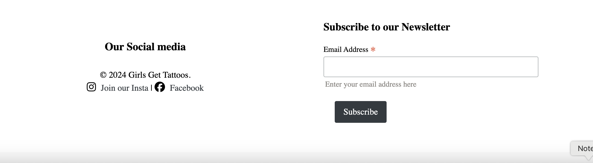  

- **Successful Subscription Confirmation**:  
  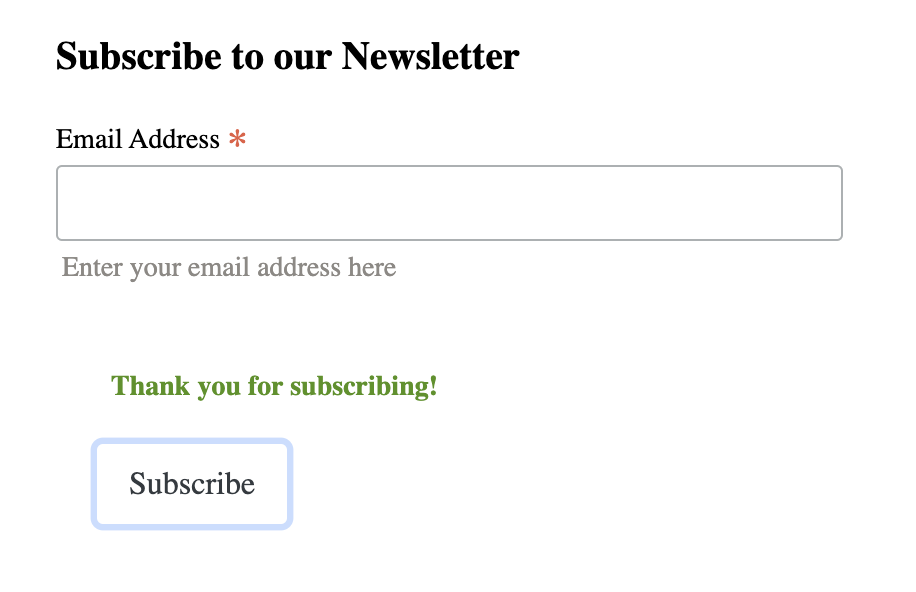  

#### **Subscription Management**
Proof of customer subscription is visible in the MailChimp dashboard, where the audience list is managed effectively:  
- **Audience Overview**:  
  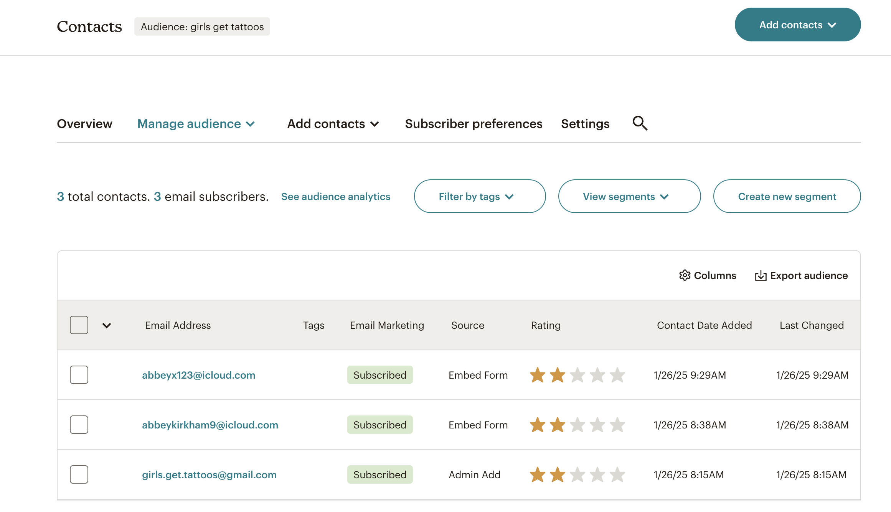  

#### **Sending Newsletters**
The admin has full control over when newsletters are sent to users. A dedicated email creation template is provided to craft engaging and professional newsletters. 

- **Newsletter Email Template**:  
  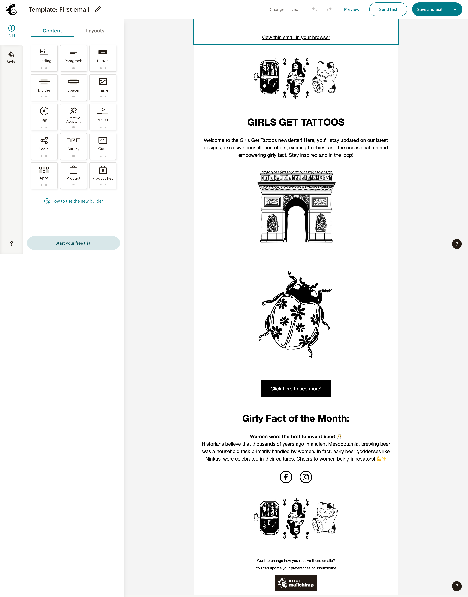  


2. **Facebook**

[GGT Facebook Page](https://www.facebook.com/groups/1338768260480770) | Facebook is essential for the store to be able to reach customers. According to the statistics, the store has a good reach among people who prefer to use Facebook. Facebook has excellent coverage worldwide among people who can purchase products online. "GGT" Facebook page is for marketing purposes to post adverts and exciting content and engage users.

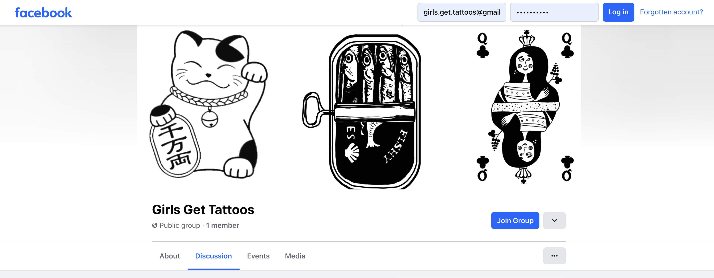

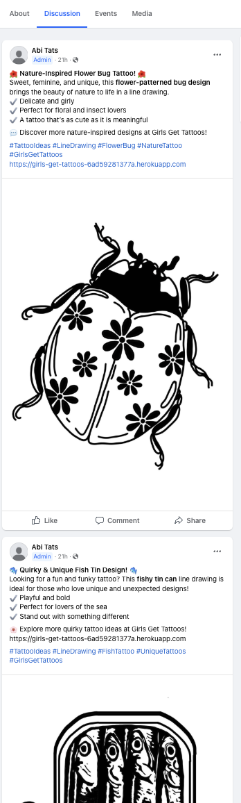

3. **Instagram**

[GGT Instagram Page](www.instagram.com/girls.get.tattoos) | Instagram attracts people of younger ages and is essential for the store to reach this demographic. According to a 2023 report by DataReportal, approximately 70% of Instagram’s global advertising audience is under 34 years old [See Report](https://datareportal.com/essential-instagram-stats?utm_source=chatgpt.com). "GGT" Instagram page is for marketing purposes to post adverts, interesting content, and engage users.


---


## Future Development  

### Tech Support Chat  
A chat support feature is planned to provide customers with the highest standard of service.  

As the application already uses ASGI instead of WSGI, implementing chat support in the future will be more straightforward with Django Channels and Redis channel layers.  

### Third-Party Registration  
Facebook and Twitter were not considered for future development at this stage due to their additional business requirements. Google, being the most popular third-party registration service and relatively easy to implement, was prioritised. However, it is not accessible in all countries and regions, such as China.  

### Payment System  
The integration of PayPal as a payment option is planned for the future, as it is a preferred choice for many customers. Additionally, Alipay and WeChat Pay functionality are being considered for inclusion alongside the existing Stripe payment system, as these options are widely used in Asian countries, including China and Thailand.  

### Order Cancellation  
Further research and analysis are required for the order cancellation feature, which is why it has not been implemented at this stage.  

### Elastic Search  
Elastic Search is recognised as an essential feature for future development, as it has the potential to significantly enhance search speed and improve the quality of search results.  

### Deferred Features  
The decision to defer certain features was made thoughtfully. As a developer, it is necessary to evaluate the importance of each feature, estimate the time required for their development, and plan their implementation accordingly.  

Understanding the exact operational procedures of a real business is crucial. For instance, insights into product prioritisation will play a vital role in setting up recommendation functionality. Therefore, some features have been intentionally left as opportunities for future learning and development.  

---

## Technologies Used

### Languages
- **Python 3.11.9**: The primary language used to develop the server-side of the website.  
  [Official Python Website](https://www.python.org/downloads/release/python-385/)
- **JavaScript (JS)**: The primary language used to develop interactive components of the website.  
  [MDN JavaScript Docs](https://developer.mozilla.org/en-US/docs/Web/JavaScript)
- **HTML**: The markup language used to create the website.  
  [MDN HTML Docs](https://developer.mozilla.org/en-US/docs/Web/HTML)
- **CSS**: The styling language used to style the website.  
  [MDN CSS Docs](https://developer.mozilla.org/en-US/docs/Web/CSS)

### Frameworks and Libraries
- **Django**: Python framework used to create all the logic.  
  [Official Django Website](https://www.djangoproject.com/)
- **jQuery**: Used to control click events and send AJAX requests.  
  [Official jQuery Website](https://jquery.com/)
- **jQuery UI**: Used to create interactive elements.  
  [jQuery UI Website](https://jqueryui.com/)

### Databases
- **SQLite**: Used as a development database.  
  [Official SQLite Website](https://www.sqlite.org/)
- **PostgreSQL**: The database used to store all the data.  
  [Official PostgreSQL Website](https://www.postgresql.org/)

### Other Tools
- **Git**: The version control system used to manage the code.  
  [Official Git Website](https://git-scm.com/)
- **Pip3**: The package manager used to install dependencies.  
  [Pip3 Documentation](https://pip.pypa.io/en/stable/)
- **Gunicorn**: The web server used to run the website.  
  [Official Gunicorn Website](https://gunicorn.org/)
- **Psycopg2**: The database driver used to connect to the PostgreSQL database.  
  [Official Psycopg2 Website](https://www.psycopg.org/)
- **Django-allauth**: The authentication library used to create user accounts.  
  [Django-allauth Docs](https://django-allauth.readthedocs.io/)
- **Django-crispy-forms**: Used to control the rendering behavior of Django forms.  
  [Django-crispy-forms Docs](https://django-crispy-forms.readthedocs.io/)
- **GitHub**: Used to host the website's source code.  
  [Official GitHub Website](https://github.com/)
- **Chrome DevTools**: Used to debug the website.  
  [Chrome DevTools Docs](https://developer.chrome.com/docs/devtools/)
- **Font Awesome**: Used to create the icons used on the website.  
  [Official Font Awesome Website](https://fontawesome.com/)
- **Coolors**: Used to create a color palette for the website.  
  [Official Coolors Website](https://coolors.co/)
- **W3C Validator**: Used to validate HTML5 code for the website.  
  [W3C HTML Validator](https://validator.w3.org/)
- **W3C CSS Validator**: Used to validate CSS code for the website.  
  [W3C CSS Validator](https://jigsaw.w3.org/css-validator/)
- **JShint**: Used to validate JS code for the website.  
  [Official JShint Website](https://jshint.com/)
- **PEP8**: Used to validate Python code for the website.  
  [PEP8 Docs](https://pep8.org/)
- **GeoNames**: Used to get country and city names.  
  [Official GeoNames Website](https://www.geonames.org/)
- **Stripe**: Used to create the payment system.  
  [Official Stripe Website](https://stripe.com/)
- **Birme.net**: Used to crop and center Unsplash images.  
  [Official Birme.net Website](https://birme.net/)
- **Sitemap Generator**: Used to create the `sitemap.xml` file.  
  [XML Sitemap Generator](https://www.xml-sitemaps.com/)
- **Privacy Policy Generator**: Used to create the privacy policy.  
  [Privacy Policy Generator](https://www.privacypolicygenerator.info/)
- **Django-extensions**: Used to create an Entity-Relationship Diagram.  
  [Django-extensions Docs](https://django-extensions.readthedocs.io/)

---

## Features


Please refer to the [FEATURES.md](FEATURES.md) file for all test-related documentation.

#### Featuring:

- **Authentication**: User registration and login via email or social media.
- **User Profiles**: Save favorite tattoo designs, view order history, and bookings.
- **Stripe Payment Integration**: Secure payments for tattoos and consultations.
- **Consultation Booking**: Users can select dates from a calendar and manage appointments.
- **Admin Interface**: Manage orders, consultations, and calendar events.
- **SEO & Marketing**: SEO implementation, including robots.txt, sitemap, and meta tags.

---

## Design Philosophy
The website embraces a minimalistic, black-and-white theme to echo the artistic nature of tattoos and ensure the designs remain the primary focus. By stripping away all distractions, this monochrome palette provides a clean, timeless aesthetic that enhances the browsing experience for both customers and tattoo enthusiasts.


### Colour Scheme
The site exclusively uses black and white as the foundational colours:

- **Background:** White (`#FFFFFF`) to create a clean and spacious environment.
- **Text and Elements:** Black (`#000000`) for strong contrast and optimal readability.
- **Interactive Elements (e.g., buttons, hover states):** Subtle gradients or bold black borders to differentiate interactions without straying from the monochrome theme.

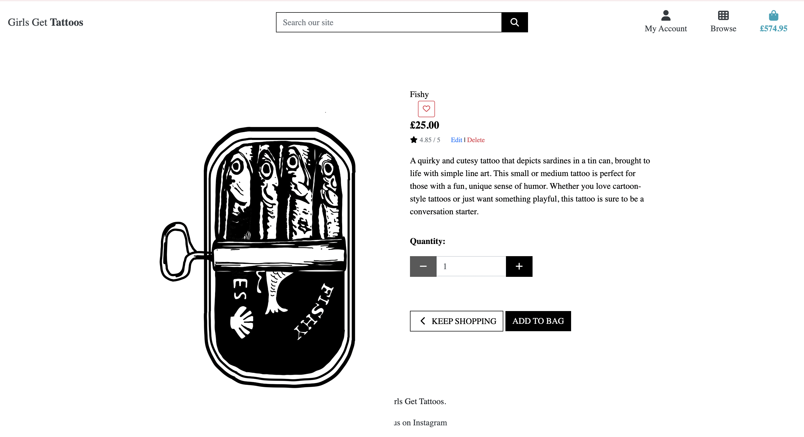

This stark contrast ensures that every tattoo design and visual element stands out while maintaining an understated, professional look.

## Typography
The website uses the font **Montserrat**, chosen for its modern and versatile aesthetic, which aligns with the bold and creative energy of tattoo art. Montserrat ensures legibility and elegance across all devices and screen sizes.

- **Headings:** Font-weight set to **900**, emphasising key information such as "New Designs Are Here." This bold choice commands attention and reflects the strength and permanence of tattoos.
- **Body Text:** Font-weight set to **400**, providing a clean, smooth reading experience without overwhelming the viewer.
- **Buttons and Calls to Action:** Font-weight set to **700**, striking a balance between emphasis and consistency, encouraging user engagement.

## Imagery

- All imagery was sticking to my professional development in grapic design, all drawn by myself.


The result is a bold and refined aesthetic that ensures a seamless and impactful user experience, perfectly complementing the artistic nature of tattoo designs.

---

## Wireframes

I have designed multiple wireframes to visually represent the layout and functionality of the application. These wireframes were created using [Canva](https://www.canva.com/) , a versatile and user-friendly design tool.

You can view the wireframes through the following link:

  [GGT Wireframes](READMEmedia/wireframe-profile-phone-merged.pdf)

These wireframes provide a detailed overview of the interface design, ensuring that the structure and user experience align with the project’s goals. They serve as a foundational step in the development process, helping to guide further discussions and decisions.

---

## Agile Methodology


### GitHub Project Management
GitHub Project Management was used to manage the project. Without GitHub Project Management, it would have been difficult to effectively oversee the development of the application. It provided the tools necessary to:

- Prioritise tasks  
- Track progress  
- Ensure a structured workflow  

This methodology ensured the project stayed on track and that all aspects of development were properly managed.

---

## Flowchats

To understand some concepts, I created a couple flowchart diagrams.

1. The purchasing flow chart will show what steps are required to successfully complete a purchase.

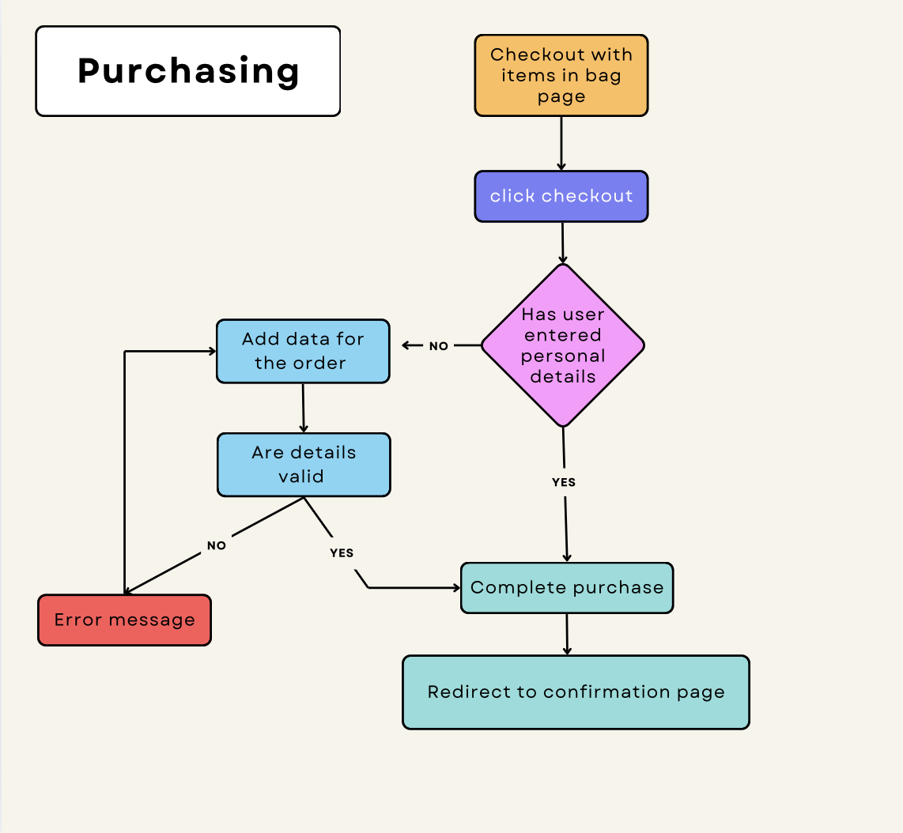

2. The consultation flow chart wil show what a user needs to do in order to book a consultation.

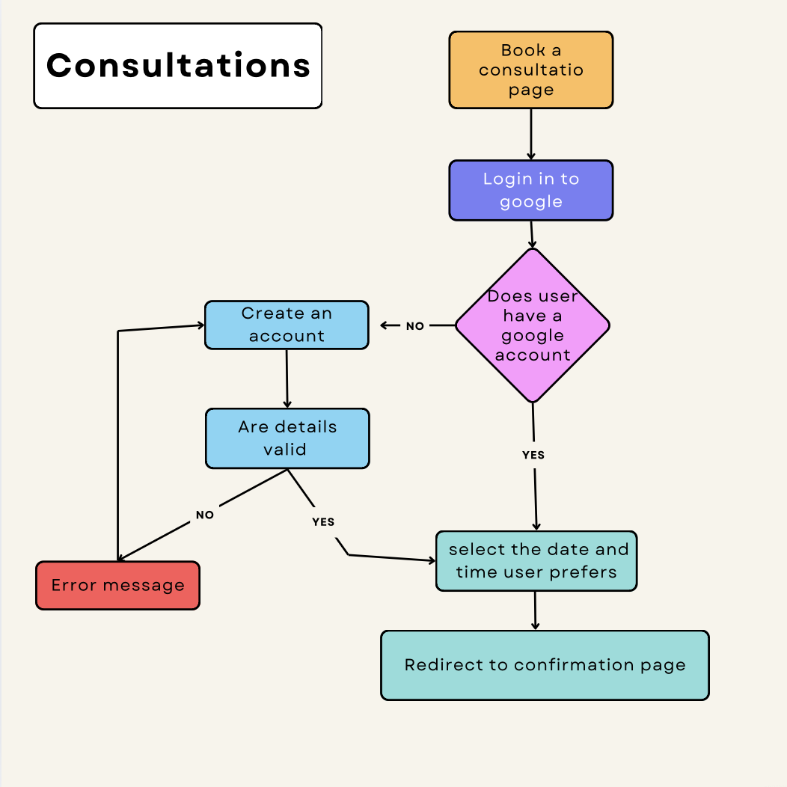

---
## Data Models

This document outlines the core data models used in the application. Each model is designed to handle specific functionality and relationships, ensuring a scalable and efficient database structure.

---

### Order Model

The `Order` model handles user orders, including bookings and pricing. It ensures accurate calculation of order totals and includes a unique order number.

| Name              | Database Key      | Field Type      | Validation                                      |
|-------------------|-------------------|-----------------|-------------------------------------------------|
| Order Number      | order_number      | CharField       | `max_length=32, editable=False`                 |
| User Profile      | user_profile      | ForeignKey      | `UserProfile, on_delete=models.SET_NULL, null=True, blank=True, related_name='orders'` |
| Full Name         | full_name         | CharField       | `max_length=50, null=False, blank=False`        |
| Email             | email             | EmailField      | `max_length=254, null=False, blank=False`       |
| Phone Number      | phone_number      | CharField       | `max_length=20, null=False, blank=False`        |
| Country           | country           | CharField       | `max_length=40, null=False, blank=False`        |
| Postcode          | postcode          | CharField       | `max_length=20, null=True, blank=True`          |
| Town/City         | town_or_city      | CharField       | `max_length=40, null=False, blank=False`        |
| Street Address 1  | street_address1   | CharField       | `max_length=80, null=False, blank=False`        |
| Street Address 2  | street_address2   | CharField       | `max_length=80, null=True, blank=True`          |
| County            | county            | CharField       | `max_length=80, null=True, blank=True`          |
| Date              | date              | DateTimeField   | `auto_now_add=True`                             |
| Order Total       | order_total       | DecimalField    | `max_digits=10, decimal_places=2, default=0`    |
| Grand Total       | grand_total       | DecimalField    | `max_digits=10, decimal_places=2, default=0`    |

---

### Order Line Item Model

Tracks individual items in an order, including product details and line item totals.

| Name            | Database Key    | Field Type     | Validation                                      |
|-----------------|-----------------|----------------|-------------------------------------------------|
| Order           | order           | ForeignKey     | `Order, on_delete=models.CASCADE, related_name='lineitems'` |
| Product         | product         | ForeignKey     | `Product, on_delete=models.CASCADE`             |
| Quantity        | quantity        | IntegerField   | `default=0`                                     |
| Line Item Total | lineitem_total  | DecimalField   | `max_digits=6, decimal_places=2, editable=False` |

---

### Contact Message Model

Stores messages submitted by users through the contact form.

| Name    | Database Key | Field Type   | Validation                              |
|---------|--------------|--------------|-----------------------------------------|
| Name    | name         | CharField    | `max_length=100, null=False, blank=False` |
| Email   | email        | EmailField   | `null=False, blank=False`               |
| Message | message      | TextField    | `null=False, blank=False`               |
| Read    | read         | BooleanField | `default=False`                         |

---

### Category Model

Organizes products into categories for easier browsing and filtering.

| Name           | Database Key  | Field Type   | Validation                                      |
|----------------|---------------|--------------|-------------------------------------------------|
| Name           | name          | CharField    | `max_length=254, null=False, blank=False`       |
| Friendly Name  | friendly_name | CharField    | `max_length=254, null=True, blank=True`         |

---

### Product Model

Stores product information available for purchase.

| Name        | Database Key | Field Type   | Validation                                               |
|-------------|--------------|--------------|----------------------------------------------------------|
| Category    | category     | ForeignKey   | `Category, on_delete=models.SET_NULL, null=True, blank=True` |
| SKU         | sku          | CharField    | `max_length=254, null=True, blank=True`                  |
| Name        | name         | CharField    | `max_length=254, null=False, blank=False`                |
| Description | description  | TextField    | `null=False, blank=False`                                |
| Price       | price        | DecimalField | `max_digits=6, decimal_places=2`                         |
| Rating      | rating       | DecimalField | `max_digits=6, decimal_places=2, null=True, blank=True`  |
| Image URL   | image_url    | URLField     | `max_length=1024, null=True, blank=True`                 |
| Image       | image        | ImageField   | `null=True, blank=True`                                  |

---

### Like Feature

Allows users to like/unlike products. Liked products are shown on a dedicated page.

#### How It Works

- `Like` model links a user to a liked product.
- AJAX requests (secured with CSRF) toggle likes.
- Liked items are dynamically updated on the frontend.
- A list of liked items is shown via `liked_items_view`.

#### Model

```python
class Like(models.Model):
    user = models.ForeignKey(User, on_delete=models.CASCADE)
    product = models.ForeignKey(Product, on_delete=models.CASCADE)
    liked_on = models.DateTimeField(auto_now_add=True)

    def __str__(self):
        return f"{self.user} likes {self.product.name}"

```

Views

like_view: Toggles like/unlike via AJAX.
liked_items_view: Displays liked products for the user.
Template: liked_items.html

Loops through liked items and links to product detail pages.

### JavaScript (AJAX Example)

```javascript
        $(document).on('click', '.likeButton', function() {
            const button = $(this);
            const productId = button.data('post-id');
            const url = button.data('url');
            const csrfToken = document.querySelector('meta[name="csrf-token"]').getAttribute('content');

            $.ajax({
                url: url,
                type: 'POST',
                headers: {
                    'X-CSRFToken': csrfToken
                },
                data: {
                    'product_id': productId
                },
                success: function(response) {
                    alert('Product liked successfully!');
                    button.find('i').toggleClass('far fas');
                },
                error: function(response) {
                    alert('Failed to like the product.');
                }
            });
        });
```

### Contact Form Feature

Allows users to contact the business. Messages are saved and marked read/unread by admins.

Model

```python
    class ContactMessage(models.Model):
        name = models.CharField(max_length=100)
        email = models.EmailField()
        message = models.TextField()
        read = models.BooleanField(default=False)

```

Views:

contact_view
Templates:

contact.html


### Consultation Interest Feature
Users can express interest in tattoo consultations.

How It Works

ConsultationInterest model stores topic, time, message, and user.
express_interest view saves data.
Admins view submissions via consultation_admin_view at /admin-submissions.
Templates:

consultation_interest.html
consultation_admin.html
Product CRUD Feature
Admins can add, edit, or delete products. All users can view listings.

#### Model
```python
      class Product(models.Model):
          category = models.ForeignKey('Category', null=True, blank=True, on_delete=models.SET_NULL)
          sku = models.CharField(max_length=254, null=True, blank=True)
          name = models.CharField(max_length=254)
          description = models.TextField()
          price = models.DecimalField(max_digits=6, decimal_places=2)
          rating = models.DecimalField(max_digits=6, decimal_places=2, null=True, blank=True)
          image_url = models.URLField(max_length=1024, null=True, blank=True)
          image = models.ImageField(null=True, blank=True)

```

Views:

add_product, edit_product, delete_product, all_products
Templates:

add_product.html, edit_product.html, products.html


### User Profile Feature

Manages user info for streamlined checkout.

Model

```python
        class UserProfile(models.Model):
            user = models.OneToOneField(User, on_delete=models.CASCADE)
            default_phone_number = models.CharField(max_length=20, null=True, blank=True)
            default_country = CountryField(blank_label='Country *', null=True, blank=True)
            default_postcode = models.CharField(max_length=20, null=True, blank=True)
            default_town_or_city = models.CharField(max_length=40, null=True, blank=True)
            default_street_address1 = models.CharField(max_length=80, null=True, blank=True)
            default_street_address2 = models.CharField(max_length=80, null=True, blank=True)
            default_county = models.CharField(max_length=80, null=True, blank=True)

```

Views:

profile_view
Template:

profile.html


### Custom Widgets
CustomClearableFileInput:
A user-friendly file input widget that supports image uploads, current image display, and removal options for consultation images.


---
## CRUD 

Below is a demonstration of the full CRUD functionality for products on the site, including **Create**, **Read**, **Update**, **Delete**, and a simulated **Like/Favourite** feature.


### 1. Create – Adding a New Product

Users with appropriate permissions can add a new product through the admin panel or a product form.

**Screenshot: Add Product Form**  
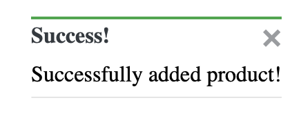


### 2. Read – Viewing a Product

All users can browse products from the store. Clicking on a product displays detailed information such as price, image, and description.

**Screenshot: Product Detail Page**  
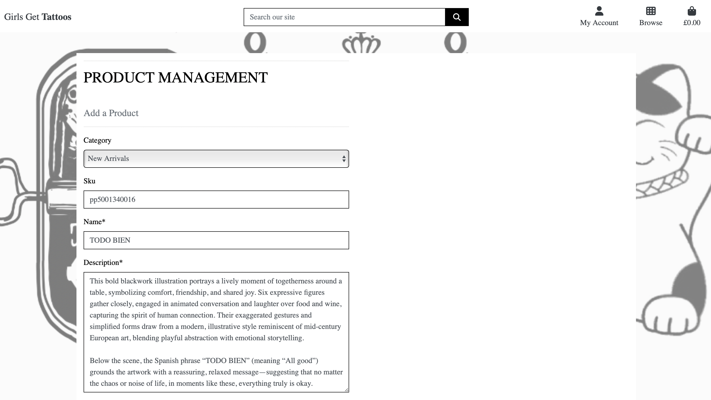
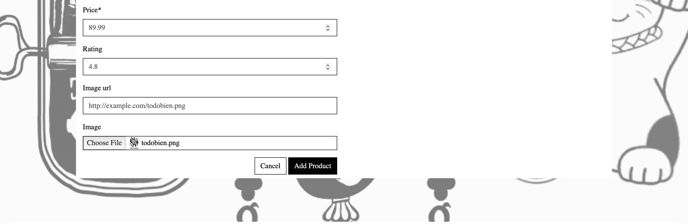

### 3. Update – Editing a Product

Admins or store managers can update a product’s details such as name, price, category, or image.

**Screenshot: Edit Product**  
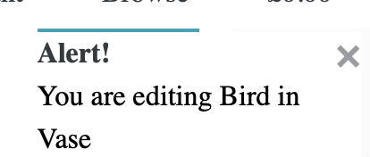
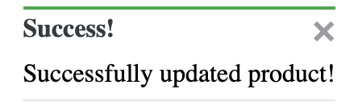


### 4. Delete – Removing a Product

Admins can delete a product. Once removed, it no longer appears on the storefront.

**Screenshot: Delete Confirmation**  
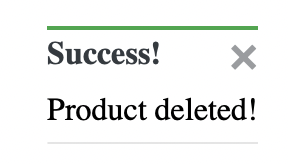


### 5. Like / Favourite a Product *(Optional)*

Logged-in users can favourite products to save them for later viewing.

**Screenshot: Favourite Button & Favourites Page**  
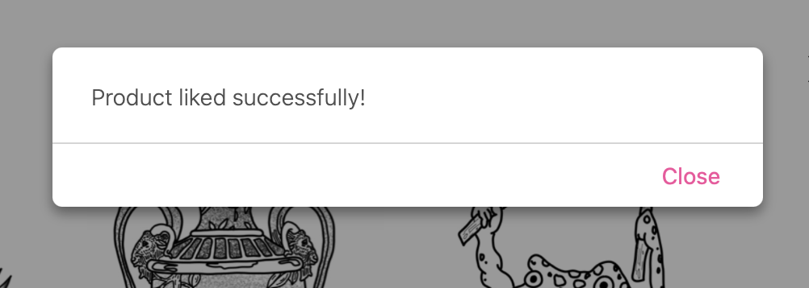


## CRUD Summary Table

| Action   | Who Can Perform  | Method         | Result                         |
|----------|------------------|----------------|--------------------------------|
| Create   | Admin / Manager  | Form or Admin  | New product added              |
| Read     | All users        | Product page   | View product details           |
| Update   | Admin / Manager  | Edit form      | Product details updated        |
| Delete   | Admin / Manager  | Delete button  | Product removed from catalog   |
| Like     | Logged-in users  | Button toggle  | Product added to favourites    |


---

## Custom 404 Page
A custom 404 error page has been implemented to improve user experience. The template is located in the `templates` directory as `404.html`.

---
## Google Calendar Integration Setup

This section explains how Google Calendar is integrated into the project and how users can use it to book consultations.

### Overview
Users can visit the consultations page to book a 30-minute video chat session to discuss graphic designs for their tattoo designs. This functionality is powered by Google Calendar API and ensures seamless scheduling.

### Integration Setup
1. **Environment Variables**:
   - Add the following environment variables to your `.env` file:
     ```env
     GOOGLE_CLIENT_ID=. ...
     GOOGLE_CLIENT_CONFIG_FILE=consultations/config/calendar.json
     GOOGLE_PROJECT_ID=girls-get-tattoos
     GOOGLE_AUTH_URI=https://accounts.google.com/o/oauth2/auth
     GOOGLE_TOKEN_URI=https://oauth2.googleapis.com/token
     GOOGLE_AUTH_PROVIDER_CERT_URL=https://www.googleapis.com/oauth2/v1/certs
     GOOGLE_CLIENT_SECRET= ...
     GOOGLE_REDIRECT_URI=https://girls-get-tattoos-6ad59281377a.herokuapp.com/oauth2callback
     ```

2. **Google Cloud Console Configuration**:
   - In the [Google Cloud Console](https://console.cloud.google.com/), ensure the following:
     - OAuth 2.0 credentials are set up.
     - The redirect URI matches: `https://girls-get-tattoos-6ad59281377a.herokuapp.com/oauth2callback`.
     - Scopes include `https://www.googleapis.com/auth/calendar`.

3. **Calendar JSON Configuration**:
   - Update `consultations/config/calendar.json`:
     ```json
     {
       "web": {
         "client_id": "client_id_here",
         "project_id": "girls-get-tattoos",
         "auth_uri": "https://accounts.google.com/o/oauth2/auth",
         "token_uri": "https://oauth2.googleapis.com/token",
         "auth_provider_x509_cert_url": "https://www.googleapis.com/oauth2/v1/certs",
         "client_secret": "secret_key_here",
         "redirect_uris": [
           "https://girls-get-tattoos-6ad59281377a.herokuapp.com/oauth2callback"
         ]
       }
     }
     ```

4. **Dependencies**:
   - Install the following libraries in your `requirements.txt`:
     ```plaintext
     google-auth==2.17.0
     google-auth-oauthlib==1.0.0
     google-api-python-client==2.70.0
     ```

5. **Session Storage**:
   - Ensure credentials are securely stored in Heroku database. Avoid hardcoding sensitive data in env.py.

6. **Django Views and URLs**:
   - Users access the consultations page (`/consultations`) to:
     - Authenticate via Google.
     - Book a session via Google Calendar.
   - The key views and URLs are defined in `consultations/views.py` and `consultations/urls.py`.

### User Workflow
1. **Access**:
   - Users navigate to the `/consultations` page.

2. **Login**:
   - If users are not authenticated with Google, they are redirected to log in.

3. **Booking**:
   - Once logged in, users can book a 30-minute session, which is added to their Google Calendar.

4. **Confirmation**:
   - A confirmation message is displayed, and the event is saved in both the user’s and your Google Calendar.

### Error Handling and Security
- **Error Handling**:
  - Ensure proper validation for tokens, state parameters, and session expiration.
- **Security**:
  - Use encrypted storage for sensitive credentials.
  - Never expose sensitive data in version control.

By following these steps, users can easily book video chat sessions through Google Calendar, streamlining the consultation process for tattoo design discussions.

### Errors in development

Please see [TESTING.md](TESTING.md) to understand the error presented when in development, explaining the inability to currently bypass.

---

## Deployment and Payment setup

- The app was deployed to [Heroku](https://heroku.com/).
- The database was deployed to [AWS](https://aws.amazon.com/free/?gclid=Cj0KCQiA1p28BhCBARIsADP9HrNnWy7i6kB1OyS1rAjnm2VmYwxEpZ6reUTK5XEi6Mfo-WmadHDh-ckaAtlVEALw_wcB&trk=ce1f55b8-6da8-4aa2-af36-3f11e9a449ae&sc_channel=ps&ef_id=Cj0KCQiA1p28BhCBARIsADP9HrNnWy7i6kB1OyS1rAjnm2VmYwxEpZ6reUTK5XEi6Mfo-WmadHDh-ckaAtlVEALw_wcB:G:s&s_kwcid=AL!4422!3!645997746383!e!!g!!aws%20console!9762827897!98496538543&all-free-tier.sort-by=item.additionalFields.SortRank&all-free-tier.sort-order=asc&awsf.Free%20Tier%20Types=*all&awsf.Free%20Tier%20Categories=*all).


Please refer to the [DEPLOYMENT.md](DEPLOYMENT.md) file for all deployment and payment-related documentation.

---


## Testing 

Please refer to the [TESTING.md](TESTING.md) file for all test-related documentation.

---

## Credits

### Project Inspiration and Tutorials
- [WireFrames (Canva)](https://www.canva.com/): Used Canva for designing wireframes, backgrounds, and visual assets that helped guide the user interface design of the project.
- [Code Institute's Boutique Ado tutorial](https://learn.codeinstitute.net/courses/course-v1:CodeInstitute+EA101+4/courseware/eb05f06e62c64ac89823cc956fcd8191/0713d55c023943438d418d83caf4171b/): The base for my project. 

### Frontend Design and Styling
- [Text over image](https://www.w3schools.com/howto/howto_css_image_text.asp): Utilised this guide to effectively overlay text on images, enhancing visual appeal and usability.
- [Google Fonts](https://fonts.google.com/selection/embed): Selected and embedded fonts to ensure the app has a cohesive and attractive typography.

### Icons and Images
- [Favicon Generator](https://favicon.io/favicon-generator/): Created a custom favicon to enhance the branding and recognition of our web application.

## Functionality and Features
- [Stripe](https://dashboard.stripe.com/): This project uses Stripe for secure payment processing, enabling seamless and reliable transactions with industry-leading security standards.
- [Stripe Testing](https://docs.stripe.com/testing): These test cards were a neccessity for testing my fuctionality. 
- [Like count implementation](https://dev.to/radualexandrub/how-to-add-like-unlike-button-to-your-django-blog-5gkg): Incorporated a like/unlike feature for posts, enabling user interaction and engagement.

### Technical Documentation and References
- [Django Documentation](https://docs.djangoproject.com/en/5.0/topics/http/views/): Consulted extensively for understanding and implementing various Django views.
- [Django Forms](https://docs.djangoproject.com/en/5.0/topics/forms/): Used to manage and validate forms within the app.
- [Django Models](https://docs.djangoproject.com/en/5.0/topics/db/models/): Helped in designing and interacting with the database models.
- [Django Authentication](https://docs.djangoproject.com/en/5.0/topics/auth/): Implemented authentication features, ensuring secure user access and management.
- [Django File Uploads](https://docs.djangoproject.com/en/5.0/topics/http/file-uploads/): Managed user-uploaded files, including profile images.
- [Django Admin](https://docs.djangoproject.com/en/5.1/ref/contrib/admin/): The page provides documentation for the Django Admin site, detailing its features, customisation options, and how to use it to manage application data through a web interface. 
- [Django Contact Form](https://mailtrap.io/blog/django-contact-form/): Used to create the booking form/ contact page, for these messages to be displayed on admin for superusers.
- [Google Calendar API](https://dev.to/karanjot_s/connect-google-calendar-to-django-application-3787)


### Bootstrap Features
- [Bootstrap Tables](https://getbootstrap.com/docs/4.6/content/tables/): Used Bootstrap's table component to display organized and responsive tables in the application.
- [Bootstrap Grid System](https://getbootstrap.com/docs/4.6/layout/grid/): Implemented the Bootstrap grid system for responsive layouts, ensuring the site works well across various screen sizes.
- [Bootstrap Cards](https://getbootstrap.com/docs/4.6/components/card/): Utilized Bootstrap cards for content boxes, making information display cleaner and more interactive.

### Mailchimp Integration
- [Mailchimp Embedded Forms Tutorial (YouTube)](https://www.youtube.com/watch?v=BXpNEyA89f0): Followed this tutorial for integrating Mailchimp's embedded forms into the application to manage user subscriptions.

### Toast Notifications Implementation
- [Bootstrap Toasts](https://getbootstrap.com/docs/4.6/components/toasts/): Used Bootstrap's toast component to provide non-intrusive feedback messages to users, improving UX by informing users of successful actions or errors.

### Setting up Google Cloud Console and Calendar APIs
- [Google Cloud Console Setup](https://cloud.google.com/docs/authentication/getting-started): Used this guide to set up a Google Cloud Console project and configure API access, enabling the use of Google services like Calendar and authentication.
- [Google Calendar API Setup](https://developers.google.com/calendar/quickstart/python): Followed this tutorial to integrate Google Calendar API for consultation bookings and managing appointments through Google Calendar.

### Additional Tools and Apps
- [iPad Drawing App](https://www.example-drawing-app.com): Used this app to sketch all the tattoo designs and artwork for sale on the platform, allowing for creative flexibility and digital artwork processing.

### Social Media Links
- [Instagram](https://www.instagram.com/): Connect with us on Instagram for updates and promotions.
- [Facebook](https://www.facebook.com/): Follow us on Facebook for news and community engagement.

### Acknowledgments
- [Julia Krowkaw](https://github.com/IuliiaKonovalova/e-commerce): Provided valuable insights and understanding on the implementation of models.
