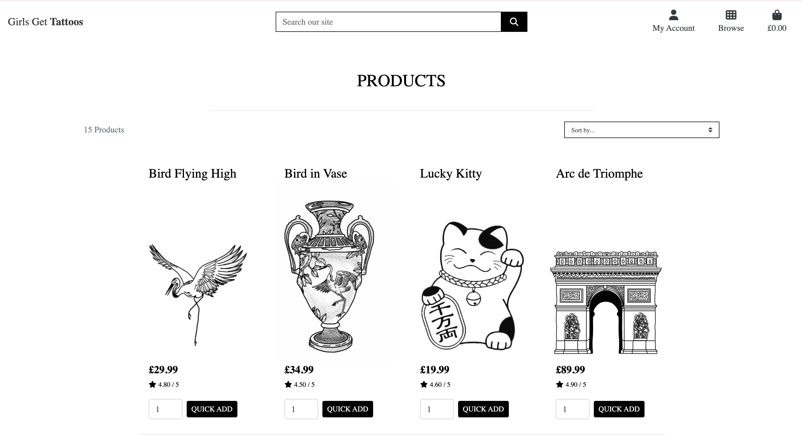

# Tattoo Design E-commerce Project


This is my e-commerce platform built using Django where customers can purchase custom or pre-designed tattoos and consultations. It integrates Stripe for secure payments, provides user authentication, and enables booking consultation appointments through a calendar system. Users can view previous orders, save favorite tattoo designs, and manage their bookings. 


## Project Overview
This is an e-commerce website focused on providing tattoo design services. Customers can:
1. Purchase pre-designed tattoos.
2. Request custom tattoo designs.
3. Book consultations to discuss tattoo ideas.
4. View their purchases bookings through an interactive calendar.
5. Pay securely via Stripe.
6. If a store owner, have the control over product and consultation management.

## Features
- **Authentication**: User registration and login via email or social media.
- **User Profiles**: Save favorite tattoo designs, view order history, and bookings.
- **Stripe Payment Integration**: Secure payments for tattoos and consultations.
- **Consultation Booking**: Users can select dates from a calendar and manage appointments.
- **Admin Interface**: Manage orders, consultations, and calendar events.
- **SEO & Marketing**: SEO implementation, including robots.txt, sitemap, and meta tags.

## User Stories
1. **Authentication and User Profiles**:
   - “As a user, I want to create an account so that I can save my favorite tattoos and view my order history.”
   - “As a user, I want to log in using my email or social media account so that I can easily access my saved items.”
   
2. **Shopping & Filtering**:
   - “As a customer, I want to filter tattoos by size and style so that I can quickly find designs that match my preferences.”
   - “As a user, I want to view a gallery of custom designs so that I can get inspired for my own tattoo.”
   
3. **Payment and Booking**:
   - “As a user, I want to book a tattoo appointment based on available slots so that I can reserve a convenient time.”
   - “As a customer, I want to pay for my tattoo consultation via Stripe so that I can secure my booking easily.”
   
4. **Checkout and Calendar**:
   - “As a customer, I want to select a date and time from an available calendar when purchasing a tattoo service so that I can schedule my session efficiently.”
   - “As a customer, I want to receive a confirmation email with my appointment details after payment so that I know my booking is confirmed.”

## Installation
To set up the project locally, follow these steps:

1. **Clone the repository**:
   ```bash
   git clone https://github.com/yourusername/tattoo-ecommerce.git
   ```

2. **Navigate to the project directory**:
   ```bash
   cd tattoo-ecommerce
   ```

3. **Set up a virtual environment**:
   ```bash
   python -m venv env
   source env/bin/activate  # For Windows: env\Scripts\activate
   ```

4. **Install the dependencies**:
   ```bash
   pip install -r requirements.txt
   ```

5. **Set up the database**:
   ```bash
   python manage.py migrate
   ```

6. **Create a superuser for accessing the admin interface**:
   ```bash
   python manage.py createsuperuser
   ```

7. **Run the development server**:
   ```bash
   python manage.py runserver
   ```

... process to shopping and management.

## Technologies Used
- **Django**: Web framework.
- **PostgreSQL**: Database.
- **Stripe API**: Payment gateway.
- **JavaScript**: For calendar and interactive elements.
- **HTML/CSS**: Front-end structure and design.
- **Bootstrap**: Responsive design.
- **Celery/Redis**: For handling background tasks (e.g., confirmation emails).
- **AWS**: For user interface for static files.

## Stripe Payment Integration
I have integrated Stripe to process payments for:
- Pre-designed tattoos.
- Consultation bookings.

I will set up my Stripe API keys in my Django settings:

```python
STRIPE_PUBLIC_KEY = 'your_public_key_here'
STRIPE_SECRET_KEY = 'your_secret_key_here'
```

## SEO and Web Marketing
- **SEO**: 
  - A `robots.txt` file will be added to the project to guide web crawlers.
  - A `sitemap.xml` file will be created to help with indexing. https://www.xml-sitemaps.com/details-girls-get-tattoos-6ad59281377a.herokuapp.com-da3b5e825.html
  - Descriptive meta tags are included on all key pages.
  
- **Marketing**:
  - A mockup Instagram business page is created for social media marketing which can be accessed in the header. 
  [Instagram Page](www.instagram.com/girls.get.tattoos)

## Agile Methodology
I followed Agile methodologies throughout the project:
- **User Stories**: Clearly defined user stories were created and tracked using GitHub Projects.
- **Tasks**: Each feature was broken down into individual tasks, which were tracked in GitHub issues. (You will be able to view this in the closed/completed section of the issues).
- **Iterative Development**: The project was built in iterative cycles with regular updates to features and testing.


## Custom Models
1. **TattooDesign**: Stores information about tattoo designs (custom or pre-made).
2. **Consultation**: Handles booking of consultation appointments and stores relevant info.
3. **Order**: Stores user order history, including tattoo designs and consultations.

### Consultation model

#### Django E-Commerce Consultation Site

This is my Django-based e-commerce site where users can browse, book, and manage consultations. Below, I explain how the various components work together to create a personalized experience for users and administrators.

##### Models

1. **Consultation Model**:
   - This defines the properties of consultations like name, price, description, and image. It helps organize the consultations in the database and represents them in a human-readable format using the `__str__` method.

2. **ConsultationAvailability Model**:
   - Tracks when a consultation is available. Each consultation can have multiple availability slots, and `is_booked` indicates whether a date is already booked.

3. **ConsultationBooking Model**:
   - Links a user to a specific consultation and availability date. It tracks the booking details, including the user who made the booking and the date of the consultation.

##### Views

1. **`all_consultations`**:
   - Displays all consultations with options to search and sort them by name or price.

2. **`consultation_detail`**:
   - Shows details of a consultation with available dates for booking. Users can select a date and add it to their cart.

3. **`add_consultation`**:
   - Allows administrators to add a new consultation via a form.

4. **`edit_consultation`**:
   - Lets admins edit existing consultations using a pre-filled form.

5. **`delete_consultation`**:
   - Admins can delete consultations from the database.

##### Forms

- **ConsultationForm**:
   - This form is used for adding or editing consultations. It validates input and adds custom CSS for a better user experience.

##### Admin

- **ConsultationAdmin**:
   - I set up the admin interface to manage consultations and their availability. It also lets me order and filter consultations easily.

##### Custom Widgets

- **CustomClearableFileInput**:
   - A custom widget to handle file inputs for consultation images with user-friendly labels for removing or displaying the current image.

##### How It Works

1. **Creating Consultations**: Admins can add consultations using the `add_consultation` view. The form automatically saves data to the `Consultation` model.
   
2. **Booking Consultations**: Users view consultations, check available dates, and book them via the `consultation_detail` view. The availability is stored in the `ConsultationAvailability` model.

3. **Tracking Bookings**: When a user books a consultation, a `ConsultationBooking` record is created to link the user, consultation, and selected date.

4. **Admin Interface**: The Django admin lets me manage consultations, their availability, and bookings all in one place.

##### Conclusion

By combining these components, I’ve built a functional consultation booking system where users can view, book, and manage consultations while admins can easily manage the site.


## Custom 404 Page
A custom 404 error page has been implemented to improve user experience. The template is located in the `templates` directory as `404.html`.

## Deployment

### Making a Local Clone to create project

- Find the GitHub Repository.
- Click the Code button
- Copy the link shown.
- In Gitpod, change the directory to the location you would like the cloned directory to be located.
- Type git clone, and paste the link you copied in step 3.
- Press Enter to have the local clone created.

### Updating my changes

git add <file> - This command was used to add the file(s) to the staging area before they are committed.

git commit -m “commit message” - This command was used to commit changes to the local repository queue ready for the final step.

git push - This command was used to update all committed code to the remote repository on github.

### Heroku


#### 1. Prepare Your Project

Ensure your project has the necessary files for deployment:

- **Procfile**: Specifies the commands that are executed by the app on startup.
    ```makefile
  python app.py 
  ```
- **requirements.txt**: Lists all the dependencies your app needs.
    ```makefile
  Flask==1.1.2
  gunicorn==20.0.4
  ```

#### 2. Create a New Heroku App
Open your terminal and log in to Heroku:

```
bash:
heroku login
Create a new app:

bash:
heroku create girls-get-tattoos
```

Alternatively, create an app directly from the Heroku dashboard by clicking "New" and then "Create new app".

#### 3. Connect Heroku App to GitHub
- Go to Heroku Dashboard: Navigate to the Heroku dashboard.
- Select Your App: Click on the app you created.
- Deploy Tab: Go to the "Deploy" tab.
- Deployment Method: Under "Deployment method", select "GitHub".
- Connect to GitHub: Authorise Heroku to access your - GitHub account if it's your first time. Search for the repository you want to connect and click "Connect".

#### 4. Configure Environment Variables
Set any necessary environment variables for your app:

Go to the "Settings" tab.
Click "Reveal Config Vars".
Add your key-value pairs.

#### 5. Manual Deployment
In the "Deploy" tab:

Go to the "Manual deploy" section.
Select the branch you want to deploy.
Click "Deploy Branch".

## My Gallery

|  |  |  |
|----------------------------------|-------------------------------------|-----------------------------------|
| A screenshot of the "Add to Bag" page featuring Frog Noodles. | An alert box with the message "You are editing Flower Bug." | A product search result for "bird," showing two items: Bird Flying High and Bird in Vase. |

|  |  |  |
|----------------------------------|---------------------------------------|---------------------------------------|
| The browse navigation tab with options for Shop, Consultation, and Contact Us. | The first part of the checkout form filled with name and email details. | The second part of the checkout form with payment details and address fields. |

|  |  |  |
|------------------------------------------|-------------------------------------------|--------------------------------|
| The detailed page for a large tattoo consultation, showing available dates. | Consultation packages for small, medium, and large tattoo designs. | Homepage featuring a banner for "The New Designs Are Here" with playful visuals. |

|  |  |  |
|--------------------------------------------|---------------------------------------|---------------------------------------|
| Consultation packages for small, medium, and large tattoo designs. | Navigation tab showing options for Product Management, My Profile, and Logout. | The profile page to update delivery details and view order history. |

|  |  |  |
|-----------------------------------------|---------------------------------------|----------------------------------------|
| Login options for Register and Login displayed under "My Account." | Detailed product page showing the Flower Bug tattoo design, price, and description. | Product management page for adding new items, including details like SKU, name, and description. |

|  |  |  |
|-----------------------------------------------------|-------------------------------------|-------------------------------------|
| Continuation of the product management form, featuring fields for price, rating, and image upload. | List of available products, including Bird Flying High, Bird in Vase, Frog Noodles, and Lucky Kitty. | A confirmation dialogue for signing out. |

|  |  |  |
|-------------------------------------|----------------------------------------|----------------------------------------|
| Sign-in page for returning users, with an option to retrieve forgotten passwords. | Success notification indicating a successful sign-in as "abiowner." | Success notification confirming the user has signed out. |

|  |
|-------------------------------------------|
| The Flower Bug tattoo product featuring a detailed image, price, rating, and edit/delete options. |


## Testing

#### HTML

<details>
<summary>Click to expand.</summary>


- [home.html](https://girls-get-tattoos-6ad59281377a.herokuapp.com/)
  
  
- [signup.html](https://girls-get-tattoos-6ad59281377a.herokuapp.com/accounts/signup/)
  

- [login.html](https://girls-get-tattoos-6ad59281377a.herokuapp.com/accounts/login/)
  

- [products.html](https://girls-get-tattoos-6ad59281377a.herokuapp.com/products/)
  

- [consultations.html](https://girls-get-tattoos-6ad59281377a.herokuapp.com/consultations/)
  

- [contact.html](https://girls-get-tattoos-6ad59281377a.herokuapp.com/contact/)
  

- [bag.html](https://girls-get-tattoos-6ad59281377a.herokuapp.com/bag/)
  

- [reset-password.html](https://girls-get-tattoos-6ad59281377a.herokuapp.com/accounts/password/reset/)
  

- [product_detail.html](https://girls-get-tattoos-6ad59281377a.herokuapp.com/products/1/)
  

- [consultation1.html](https://girls-get-tattoos-6ad59281377a.herokuapp.com/consultations/1/)
  


</details>

#### CSS

<details>
<summary>Click to expand.</summary>

- I have included only one screenshot as all the pages are linked to the same CSS and all pages load the styles consistently as can be seen in the features.


</details>

#### JAVASCRIPT

<details>
<summary>Click to expand.</summary>

- JShint
- Here I included all my javascript in one jshint validator image for testing. 


</details>


### Responsiveness 

<details>
<summary>Click to expand.</summary>

- .html


</details>

### Compatibilty 

The project has been tested for compatibility with the following browsers using this site. You will be able to see there are no issues with the compatability across these browsers:

- Google Chrome (Version 124)


- Edge (Version 124)


- Firefox (Version 124)


- Safari (Version 17)


- iE (11)


### Accessibility

By utilising the Wave Accessibility tool for ongoing development and final testing, used for the below:

1. Ensure all forms have associated labels or appropriate aria-labels.
2. Validate that color contrasts meet the minimum ratios outlined in WCAG 2.1 Contrast Guidelines.
3. Verify correct heading levels to accurately convey content importance.
4. Confirm content is organized within landmarks for ease of use with assistive technology.
5. Provide alternative text or titles for non-textual content.
6. Set the HTML page lang attribute.
7. Implement Aria properties in adherence to best practices outlined in WCAG 2.1.
8. Follow established coding best practices for WCAG 2.1.


### Manual Testing 


| Function                      | User Action                                                                 | Outcome                                                                                               | Result |
|------------------------------|-----------------------------------------------------------------------------|------------------------------------------------------------------------------------------------------|--------|
| **Load Home Page**            | Access the Girls Get Tattoos link                                            | The homepage loads with an active navigation system, site branding, and products display.            | Pass   |
| **Load Signup Page**          | From the home page, click on the "Sign Up" link                              | The signup page loads with fields for username, email, password, and a submit button.                | Pass   |
| **Load Login Page**           | From the home page, click on the "Login" link                                | The login page loads with username, password fields and a submit button.                             | Pass   |
| **Browse Products**           | From the navigation, select "Products"                                       | The products page loads with a list of available products, each with an image, name, and price.       | Pass   |
| **View Product Details**      | Click on a product from the "Products" page                                  | The product detail page loads with more information, including a description, price, and images.     | Pass   |
| **Add Product to Bag**        | On the product detail page, click "Add to Bag"                               | The item is added to the shopping bag, and the bag icon in the navigation updates with the count.     | Pass   |
| **View Shopping Bag**         | From the navigation, click on the "Bag" icon                                 | The shopping bag page loads, showing added items with quantity and price details.                    | Pass   |
| **Update Quantity in Bag**    | On the shopping bag page, update the quantity of a product                  | The page refreshes, updating the product quantity and recalculating the total price.                 | Pass   |
| **Remove Product from Bag**   | On the shopping bag page, click the "Remove" button on a product            | The product is removed from the shopping bag, and the page is updated to reflect the change.         | Pass   |
| **Proceed to Checkout**       | On the shopping bag page, click "Proceed to Checkout"                        | The checkout page loads with fields for shipping details, payment options, and a review of the order. | Pass   |
| **Submit Order**              | On the checkout page, fill in the necessary details and submit the order     | The order is placed successfully, and the user is shown a confirmation page with order details.      | Pass   |
| **Contact Us Page**           | From the navigation, click on "Contact"                                      | The contact page loads with a form for users to fill out their name, email, and message.             | Pass   |
| **Consultations Page**        | From the navigation, click on "Consultations"                                | The consultations page loads, displaying available options for users to book a tattoo consultation.  | Pass   |
| **View Consultation Details** | Click on a specific consultation service on the consultations page           | The consultation detail page loads with more information about the consultation process and pricing. | Pass   |
| **Submit Consultation Request**| On the consultation detail page, select a service and submit the form       | A success message is shown after submitting the consultation request.                                 | Pass   |
| **Forgot Password**           | On the login page, click "Forgot Password"                                   | The password reset page loads, allowing the user to input their email for a password reset.         | Pass   |
| **Login with Correct Credentials**| On the login page, enter correct username and password                  | The user is logged in successfully and redirected to the homepage or their account dashboard.         | Pass   |
| **Logout**                    | After logging in, click the "Logout" link in the navigation                  | The user is logged out and redirected to the login page.                                              | Pass   |
| **View Product in Bag**       | After adding a product to the bag, click on the bag icon                     | The bag icon updates with the product details and total price.                                        | Pass   |
| **View Account Profile**      | After logging in, click on the "Account" link in the navigation              | The user's profile page loads with their personal details, order history, and account settings.      | Pass   |
| **Update Account Details**    | On the profile page, update personal details and save                       | The updated details are saved successfully and displayed on the profile page.                        | Pass   |
| **View Order History**        | On the account profile page, click on "Order History"                        | The order history page loads, showing past orders with their details and statuses.                   | Pass   |


## Issues


- 


## Credits

### Project Inspiration and Tutorials
- [WireFrames](https://cacoo.com/diagrams/QXSJF7qPDCKNuzVk/B4F94?reload_rt=1718100120618_1&): Provided the initial design inspiration for our application's user interface, ensuring an intuitive and user-friendly layout.
- [Code Institute's Boutique Ado tutorial](https://learn.codeinstitute.net/courses/course-v1:CodeInstitute+EA101+4/courseware/eb05f06e62c64ac89823cc956fcd8191/0713d55c023943438d418d83caf4171b/): The base for my project. 

### Frontend Design and Styling
- [Text over image](https://www.w3schools.com/howto/howto_css_image_text.asp): Utilised this guide to effectively overlay text on images, enhancing visual appeal and usability.
- [Google Fonts](https://fonts.google.com/selection/embed): Selected and embedded fonts to ensure the app has a cohesive and attractive typography.

### Icons and Images
- [Favicon Generator](https://favicon.io/favicon-generator/): Created a custom favicon to enhance the branding and recognition of our web application.

## Functionality and Features
- [Stripe](https://dashboard.stripe.com/): This project uses Stripe for secure payment processing, enabling seamless and reliable transactions with industry-leading security standards.
- [Stripe Testing](https://docs.stripe.com/testing): These test cards were a neccessity for testing my fuctionality. 

### Technical Documentation and References
- [Django Documentation](https://docs.djangoproject.com/en/5.0/topics/http/views/): Consulted extensively for understanding and implementing various Django views.
- [Django Forms](https://docs.djangoproject.com/en/5.0/topics/forms/): Used to manage and validate forms within the app.
- [Django Models](https://docs.djangoproject.com/en/5.0/topics/db/models/): Helped in designing and interacting with the database models.
- [Django Authentication](https://docs.djangoproject.com/en/5.0/topics/auth/): Implemented authentication features, ensuring secure user access and management.
- [Django File Uploads](https://docs.djangoproject.com/en/5.0/topics/http/file-uploads/): Managed user-uploaded files, including profile images.
- [Django Admin](https://docs.djangoproject.com/en/5.1/ref/contrib/admin/): The page provides documentation for the Django Admin site, detailing its features, customisation options, and how to use it to manage application data through a web interface.

### Additional Features

