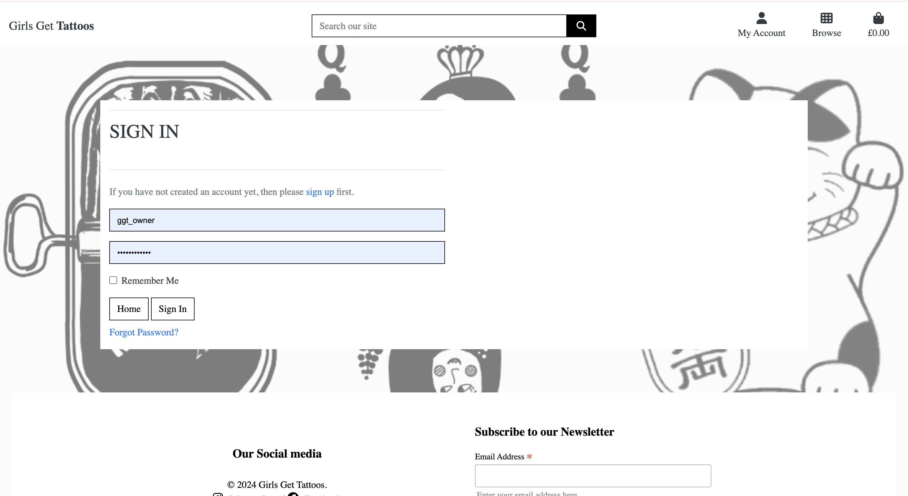
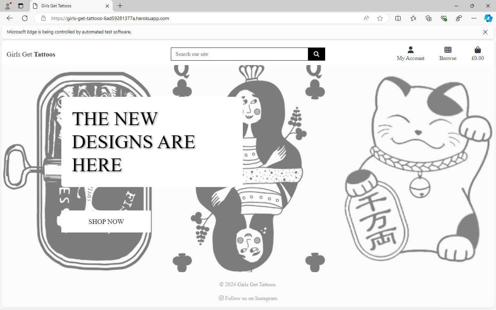

# Tattoo Design E-commerce Project


This is my e-commerce platform built using Django where customers can purchase custom or pre-designed tattoos and consultations. It integrates Stripe for secure payments, provides user authentication, and enables booking consultation appointments through a calendar system. Users can view previous orders, save favorite tattoo designs, and manage their bookings. 


## Project Overview
This is an e-commerce website focused on providing tattoo design services. Customers can:
1. Purchase pre-designed tattoos.
2. Request custom tattoo designs.
3. Book consultations to discuss tattoo ideas.
4. View their purchases bookings through an interactive calendar.
5. Pay securely via Stripe.
6. If a store owner, have the control over product and consultation management.

## UX
The website is designed with simplicity and style, aligning with the aesthetics of the tattoo culture. It ensures ease of navigation while being visually appealing. Key features include:

- Ease of Navigation: Simple and intuitive navigation across categories.
- Contrast Visuals: High-quality images to attract customers and reflect the artistic essence of tattoos.
- User-Focused: Features such as a wishlist, a newsletter, and a few social media accounts for marketing.

## Target Audience
- Primary Audience: Tattoo enthusiasts and individuals seeking tattoo-related products.
- Demographics: Women aged 18-45 with a passion for tattoo sticker art and culture.
- Goals: To make tattoo products accessible and provide a seamless shopping experience.

## Features
- **Authentication**: User registration and login via email or social media.
- **User Profiles**: Save favorite tattoo designs, view order history, and bookings.
- **Stripe Payment Integration**: Secure payments for tattoos and consultations.
- **Consultation Booking**: Users can select dates from a calendar and manage appointments.
- **Admin Interface**: Manage orders, consultations, and calendar events.
- **SEO & Marketing**: SEO implementation, including robots.txt, sitemap, and meta tags.

## User Stories for Tattoo Booking and Shopping Platform

### 1. Authentication and User Profiles

- **As a user, I want to create an account** so that I can save my favorite tattoos and view my order history.
- **As a user, I want to log in using my email or social media account** so that I can easily access my saved items.
- **As a user, I want to update my profile details** (name, email, password) so that my account information is accurate.
- **As an admin, I want to view a list of registered users** so that I can manage accounts and view their activities.

### 2. Shopping & Filtering

- **As a customer, I want to filter tattoos by size and style** so that I can quickly find designs that match my preferences.
- **As a customer, I want to sort tattoos by price or rating** so that I can find options within my budget or the highest-rated designs.
- **As a user, I want to view a gallery of custom designs** so that I can get inspired for my own tattoo.
- **As a user, I want to view detailed product information, including pricing and design descriptions** so that I can make an informed purchase.

### 3. Payment and Booking

- **As a customer, I want to add products to my cart** so that I can purchase multiple items at once.
- **As a customer, I want to securely pay for my tattoo consultation via Stripe** so that I can complete my booking without any worries.
- **As a user, I want to book a tattoo appointment based on available slots** so that I can reserve a convenient time with an artist.
- **As a user, I want to receive a confirmation email with my appointment details after payment** so that I know my booking is confirmed.

### 4. Consultation Booking

- **As a customer, I want to browse consultation packages for small, medium, and large tattoos** so that I can choose the service that fits my needs.
- **As a customer, I want to see available dates and times for consultations** so that I can select a slot that works for me.
- **As a customer, I want to cancel or reschedule my consultation if my plans change**, with an easy-to-use interface.
- **As a user, I want to view my past consultations**, including dates, artist details, and feedback, so that I can keep track of my sessions.

### 5. Wishlist and Likes

- **As a user, I want to save my favorite tattoos to a wishlist** so that I can easily return to them later.
- **As a user, I want to "like" products in the store** so that I can quickly access them from my profile.
- **As a user, I want to view all the products I've liked on a dedicated page** so that I can easily browse my favorites.

### 6. Order History and Tracking

- **As a user, I want to view my order history** so that I can track my previous purchases and consultations.
- **As a user, I want to reorder previously purchased items with a simple click** so that I can easily get a design I liked again.
- **As a user, I want to track the status of my current orders** (pending, shipped, delivered) so that I know when to expect my tattoo or consultation.

### 7. Admin Management

- **As an admin, I want to manage products and consultations in the system** so that I can keep the catalog up to date.
- **As an admin, I want to track customer purchases and consultations** so that I can offer tailored services and recommendations.
- **As an admin, I want to manage user accounts** (approve, deactivate) so that I maintain the security of the platform.

### 8. SEO & Marketing

- **As a user, I want to share tattoo designs and consultations on social media platforms like Instagram** so that I can show my choices to friends.
- **As a marketer, I want to optimize the website's SEO** using meta tags, sitemaps, and descriptions to ensure it ranks higher on search engines.
- **As a user, I want to subscribe to a newsletter** so that I can receive updates about new tattoo designs and promotions.

### 9. Accessibility

- **As a visually impaired user, I want the website to be compatible with screen readers** so that I can navigate it easily.
- **As a user, I want to have sufficient contrast in visuals** so that the website is easy to read under various lighting conditions.
- **As a user, I want the forms to have clear labels and instructions** so that I can easily fill them out without confusion.

### 10. 404 Error and Custom Pages

- **As a user, I want to be shown a custom 404 error page** if I navigate to a non-existing page so that my experience isn't disrupted with an unfriendly error.
- **As an admin, I want to update the content on the 404 error page** to reflect the website's branding, offering users helpful links to explore other parts of the site.

### 11. Security

- **As a user, I want my payment details to be securely processed via Stripe** so that I can be assured my financial information is protected.
- **As a user, I want to reset my password if I forget it**, using a secure password recovery process.
- **As an admin, I want to ensure all user data (personal information, payment details) is encrypted and securely stored** to maintain privacy.

# Business Model and Persona Summary

## Business Model

The platform operates as a **B2C (Business-to-Consumer) e-commerce website**, selling products directly to customers. It generates revenue through:

- **Product Sales**: Customers purchase tattoo products, designs, or merchandise directly through the website.
- **Optional Premium Memberships**: Users can opt for a membership that offers discounts on products or consultations.

### Persona Summary

#### Customers
- **Tattoo Enthusiasts**: These individuals are passionate about artistic designs and tattoos. They are looking for high-quality tattoo products, designs, merchandise, and accessories. They value creativity, customization, and professionalism when selecting tattoo-related services.

### Store Personnel
- **Admin**: The admin is responsible for overseeing website operations, managing products and inventory, and handling customer queries. They ensure the smooth functionality of the platform, ensuring that products are up to date and customer experiences are seamless.


## Installation
To set up the project locally, follow these steps:

1. **Clone the repository**:
   ```bash
   git clone https://github.com/yourusername/tattoo-ecommerce.git
   ```

2. **Navigate to the project directory**:
   ```bash
   cd tattoo-ecommerce
   ```

3. **Set up a virtual environment**:
   ```bash
   python -m venv env
   source env/bin/activate  # For Windows: env\Scripts\activate
   ```

4. **Install the dependencies**:
   ```bash
   pip install -r requirements.txt
   ```

5. **Set up the database**:
   ```bash
   python manage.py migrate
   ```

6. **Create a superuser for accessing the admin interface**:
   ```bash
   python manage.py createsuperuser
   ```

7. **Run the development server**:
   ```bash
   python manage.py runserver
   ```

... process to shopping and management.

## Technologies Used

### Languages
- **Python 3.8.5**: The primary language used to develop the server-side of the website.  
  [Official Python Website](https://www.python.org/downloads/release/python-385/)
- **JavaScript (JS)**: The primary language used to develop interactive components of the website.  
  [MDN JavaScript Docs](https://developer.mozilla.org/en-US/docs/Web/JavaScript)
- **HTML**: The markup language used to create the website.  
  [MDN HTML Docs](https://developer.mozilla.org/en-US/docs/Web/HTML)
- **CSS**: The styling language used to style the website.  
  [MDN CSS Docs](https://developer.mozilla.org/en-US/docs/Web/CSS)

### Frameworks and Libraries
- **Django**: Python framework used to create all the logic.  
  [Official Django Website](https://www.djangoproject.com/)
- **jQuery**: Used to control click events and send AJAX requests.  
  [Official jQuery Website](https://jquery.com/)
- **jQuery UI**: Used to create interactive elements.  
  [jQuery UI Website](https://jqueryui.com/)

### Databases
- **SQLite**: Used as a development database.  
  [Official SQLite Website](https://www.sqlite.org/)
- **PostgreSQL**: The database used to store all the data.  
  [Official PostgreSQL Website](https://www.postgresql.org/)

### Other Tools
- **Git**: The version control system used to manage the code.  
  [Official Git Website](https://git-scm.com/)
- **Pip3**: The package manager used to install dependencies.  
  [Pip3 Documentation](https://pip.pypa.io/en/stable/)
- **Gunicorn**: The web server used to run the website.  
  [Official Gunicorn Website](https://gunicorn.org/)
- **Psycopg2**: The database driver used to connect to the PostgreSQL database.  
  [Official Psycopg2 Website](https://www.psycopg.org/)
- **Django-allauth**: The authentication library used to create user accounts.  
  [Django-allauth Docs](https://django-allauth.readthedocs.io/)
- **Django-crispy-forms**: Used to control the rendering behavior of Django forms.  
  [Django-crispy-forms Docs](https://django-crispy-forms.readthedocs.io/)
- **GitHub**: Used to host the website's source code.  
  [Official GitHub Website](https://github.com/)
- **Chrome DevTools**: Used to debug the website.  
  [Chrome DevTools Docs](https://developer.chrome.com/docs/devtools/)
- **Font Awesome**: Used to create the icons used on the website.  
  [Official Font Awesome Website](https://fontawesome.com/)
- **Coolors**: Used to create a color palette for the website.  
  [Official Coolors Website](https://coolors.co/)
- **W3C Validator**: Used to validate HTML5 code for the website.  
  [W3C HTML Validator](https://validator.w3.org/)
- **W3C CSS Validator**: Used to validate CSS code for the website.  
  [W3C CSS Validator](https://jigsaw.w3.org/css-validator/)
- **JShint**: Used to validate JS code for the website.  
  [Official JShint Website](https://jshint.com/)
- **PEP8**: Used to validate Python code for the website.  
  [PEP8 Docs](https://pep8.org/)
- **GeoNames**: Used to get country and city names.  
  [Official GeoNames Website](https://www.geonames.org/)
- **Stripe**: Used to create the payment system.  
  [Official Stripe Website](https://stripe.com/)
- **Birme.net**: Used to crop and center Unsplash images.  
  [Official Birme.net Website](https://birme.net/)
- **Sitemap Generator**: Used to create the `sitemap.xml` file.  
  [XML Sitemap Generator](https://www.xml-sitemaps.com/)
- **Privacy Policy Generator**: Used to create the privacy policy.  
  [Privacy Policy Generator](https://www.privacypolicygenerator.info/)
- **Django-extensions**: Used to create an Entity-Relationship Diagram.  
  [Django-extensions Docs](https://django-extensions.readthedocs.io/)


## Design Philosophy
The website embraces a minimalistic, black-and-white theme to echo the artistic nature of tattoos and ensure the designs remain the primary focus. By stripping away all distractions, this monochrome palette provides a clean, timeless aesthetic that enhances the browsing experience for both customers and tattoo enthusiasts.

## Colour Scheme
The site exclusively uses black and white as the foundational colours:

- **Background:** White (`#FFFFFF`) to create a clean and spacious environment.
- **Text and Elements:** Black (`#000000`) for strong contrast and optimal readability.
- **Interactive Elements (e.g., buttons, hover states):** Subtle gradients or bold black borders to differentiate interactions without straying from the monochrome theme.

This stark contrast ensures that every tattoo design and visual element stands out while maintaining an understated, professional look.

## Typography
The website uses the font **Montserrat**, chosen for its modern and versatile aesthetic, which aligns with the bold and creative energy of tattoo art. Montserrat ensures legibility and elegance across all devices and screen sizes.

- **Headings:** Font-weight set to **900**, emphasising key information such as "New Designs Are Here." This bold choice commands attention and reflects the strength and permanence of tattoos.
- **Body Text:** Font-weight set to **400**, providing a clean, smooth reading experience without overwhelming the viewer.
- **Buttons and Calls to Action:** Font-weight set to **700**, striking a balance between emphasis and consistency, encouraging user engagement.

## Whitespace
Ample whitespace is implemented throughout the design, offering a breathable and uncluttered layout. This ensures users can focus entirely on the intricate tattoo designs while navigating effortlessly through the website.

---

The result is a bold and refined aesthetic that ensures a seamless and impactful user experience, perfectly complementing the artistic nature of tattoo designs.

## Agile Methodology

### GitHub Project Management
GitHub Project Management was used to manage the project. Without GitHub Project Management, it would have been difficult to effectively oversee the development of the application. It provided the tools necessary to:

- Prioritise tasks  
- Track progress  
- Ensure a structured workflow  

This methodology ensured the project stayed on track and that all aspects of development were properly managed.


## Stripe Payment Integration
I have integrated Stripe to process payments for:
- Pre-designed tattoos.
- Consultation bookings.

I will set up my Stripe API keys in my Django settings:

```python
STRIPE_PUBLIC_KEY = 'your_public_key_here'
STRIPE_SECRET_KEY = 'your_secret_key_here'
```

## SEO and Web Marketing
- **SEO**: 
  - A `robots.txt` file will be added to the project to guide web crawlers.
  - A `sitemap.xml` file will be created to help with indexing. https://www.xml-sitemaps.com/details-girls-get-tattoos-6ad59281377a.herokuapp.com-da3b5e825.html
  - Descriptive meta tags are included on all key pages.
  
- **Marketing**:
  - A mockup Instagram business page is created for social media marketing which can be accessed in the header. 
  [Instagram Page](www.instagram.com/girls.get.tattoos)

## Agile Methodology
I followed Agile methodologies throughout the project:
- **User Stories**: Clearly defined user stories were created and tracked using GitHub Projects.
- **Tasks**: Each feature was broken down into individual tasks, which were tracked in GitHub issues. (You will be able to view this in the closed/completed section of the issues).
- **Iterative Development**: The project was built in iterative cycles with regular updates to features and testing.


## Data Models

This document outlines the core data models used in the application. Each model is designed to handle specific functionality and relationships, ensuring a scalable and efficient database structure.

### Consultation Model

The `Consultation` model stores information about consultations offered. This includes details like name, description, price, and images.

| Name         | Database Key    | Field Type     | Validation                                      |
|--------------|-----------------|----------------|-------------------------------------------------|
| SKU          | sku             | CharField      | `max_length=254, null=True, blank=True`         |
| Name         | name            | CharField      | `max_length=254, null=False, blank=False`       |
| Description  | description     | TextField      | `blank=False, null=False`                       |
| Price        | price           | DecimalField   | `max_digits=6, decimal_places=2, null=False, blank=False` |
| Rating       | rating          | DecimalField   | `max_digits=6, decimal_places=2, null=True, blank=True` |
| Image URL    | image_url       | URLField       | `max_length=1024, null=True, blank=True`        |
| Image        | image           | ImageField     | `null=True, blank=True`                         |

### Consultation Availability Model

The `ConsultationAvailability` model tracks available slots for consultations. Each slot is linked to a specific consultation and has an `is_booked` flag to track its status.

| Name            | Database Key       | Field Type      | Validation                                         |
|-----------------|--------------------|-----------------|----------------------------------------------------|
| Consultation    | consultation       | ForeignKey      | `Consultation, related_name='availabilities', on_delete=models.CASCADE` |
| Available Date  | available_date     | DateTimeField   | `null=False, blank=False`                          |
| Is Booked       | is_booked          | BooleanField    | `default=False`                                    |

**Note**: Each consultation and available date combination must be unique.

### Consultation Booking Model

The `ConsultationBooking` model links users to consultations and their availability. It captures booking details like the user, the consultation, and the selected date.

| Name               | Database Key      | Field Type      | Validation                                      |
|--------------------|-------------------|-----------------|-------------------------------------------------|
| User               | user              | ForeignKey      | `User, on_delete=models.CASCADE`                |
| Consultation      | consultation      | ForeignKey      | `Consultation, on_delete=models.CASCADE`        |
| Consultation Date | consultation_date | ForeignKey      | `ConsultationAvailability, on_delete=models.CASCADE` |
| Created At        | created_at        | DateTimeField   | `auto_now_add=True`                              |

### Order Model

The `Order` model handles user orders, including delivery details and pricing. It ensures accurate calculation of order totals and includes a unique order number.

| Name              | Database Key      | Field Type      | Validation                                      |
|-------------------|-------------------|-----------------|-------------------------------------------------|
| Order Number      | order_number      | CharField       | `max_length=32, editable=False`                 |
| User Profile      | user_profile      | ForeignKey      | `UserProfile, on_delete=models.SET_NULL, null=True, blank=True, related_name='orders'` |
| Full Name         | full_name         | CharField       | `max_length=50, null=False, blank=False`        |
| Email             | email             | EmailField      | `max_length=254, null=False, blank=False`       |
| Phone Number      | phone_number      | CharField       | `max_length=20, null=False, blank=False`        |
| Country           | country           | CharField       | `max_length=40, null=False, blank=False`        |
| Postcode          | postcode          | CharField       | `max_length=20, null=True, blank=True`          |
| Town/City         | town_or_city      | CharField       | `max_length=40, null=False, blank=False`        |
| Street Address 1  | street_address1   | CharField       | `max_length=80, null=False, blank=False`        |
| Street Address 2  | street_address2   | CharField       | `max_length=80, null=True, blank=True`          |
| County            | county            | CharField       | `max_length=80, null=True, blank=True`          |
| Date              | date              | DateTimeField   | `auto_now_add=True`                              |
| Delivery Cost     | delivery_cost     | DecimalField    | `max_digits=6, decimal_places=2, default=0`     |
| Order Total       | order_total       | DecimalField    | `max_digits=10, decimal_places=2, default=0`    |
| Grand Total       | grand_total       | DecimalField    | `max_digits=10, decimal_places=2, default=0`    |

### Order Line Item Model

The `OrderLineItem` model tracks individual items in an order, including product details and line item totals.

| Name              | Database Key    | Field Type     | Validation                                      |
|-------------------|-----------------|----------------|-------------------------------------------------|
| Order             | order           | ForeignKey     | `Order, on_delete=models.CASCADE, related_name='lineitems'` |
| Product           | product         | ForeignKey     | `Product, on_delete=models.CASCADE`             |
| Quantity          | quantity        | IntegerField   | `default=0`                                      |
| Line Item Total   | lineitem_total  | DecimalField   | `max_digits=6, decimal_places=2, editable=False` |

### Contact Message Model

The `ContactMessage` model stores messages submitted by users through the contact form. It includes a flag to mark whether the message has been read.

| Name     | Database Key    | Field Type   | Validation                        |
|----------|-----------------|--------------|-----------------------------------|
| Name     | name            | CharField    | `max_length=100, null=False, blank=False` |
| Email    | email           | EmailField   | `null=False, blank=False`         |
| Message  | message         | TextField    | `null=False, blank=False`         |
| Read     | read            | BooleanField | `default=False`                   |

### Category Model

The `Category` model organizes products into categories, making it easier to filter and browse.

| Name           | Database Key  | Field Type   | Validation                                      |
|----------------|---------------|--------------|-------------------------------------------------|
| Name           | name          | CharField    | `max_length=254, null=False, blank=False`       |
| Friendly Name  | friendly_name | CharField    | `max_length=254, null=True, blank=True`         |

### Product Model

The `Product` model stores details about items available for purchase, including links to their categories, brands, and tags.

| Name           | Database Key  | Field Type   | Validation                                      |
|----------------|---------------|--------------|-------------------------------------------------|
| Category       | category      | ForeignKey   | `Category, on_delete=models.SET_NULL, null=True, blank=True` |
| SKU            | sku           | CharField    | `max_length=254, null=True, blank=True`         |
| Name           | name          | CharField    | `max_length=254, null=False, blank=False`       |
| Description    | description   | TextField    | `null=False, blank=False`                       |
| Price          | price         | DecimalField | `max_digits=6, decimal_places=2`                |
| Rating         | rating        | DecimalField | `max_digits=6, decimal_places=2, null=True, blank=True` |
| Image URL      | image_url     | URLField     | `max_length=1024, null=True, blank=True`        |
| Image          | image         | ImageField   | `null=True, blank=True`                         |


##### Admin

- **ConsultationAdmin**:
   - I set up the admin interface to manage consultations and their availability. It also lets me order and filter consultations easily.

##### Custom Widgets

- **CustomClearableFileInput**:
   - A custom widget to handle file inputs for consultation images with user-friendly labels for removing or displaying the current image.

##### How It Works

1. **Creating Consultations**: Admins can add consultations using the `add_consultation` view. The form automatically saves data to the `Consultation` model.
   
2. **Booking Consultations**: Users view consultations, check available dates, and book them via the `consultation_detail` view. The availability is stored in the `ConsultationAvailability` model.

3. **Tracking Bookings**: When a user books a consultation, a `ConsultationBooking` record is created to link the user, consultation, and selected date.

4. **Admin Interface**: The Django admin lets me manage consultations, their availability, and bookings all in one place.


By combining these components, I’ve built a functional consultation booking system where users can view, book, and manage consultations while admins can easily manage the site.

### Likes model

This feature allows users to "like" products in the e-commerce store. Below, I explain how the components work together to implement the like functionality, display liked items, and update the UI dynamically.

#### Models

1. **Like Model**:
   - This model links users to the products they like. It stores the user and the liked product as foreign keys, along with the timestamp of when the like occurred. The `__str__` method provides a human-readable format like "User likes Product Name."

#### Views

1. **`like_view`**:
   - Handles the AJAX request to like or unlike a product. It checks if the user is authenticated, gets the product using the `product_id` from the POST request, and creates or updates a `Like` record for the user and product. It returns a JSON response indicating the success or failure of the operation.

2. **`liked_items_view`**:
   - Displays a list of all liked products for the authenticated user. It fetches liked items from the `Like` model, displaying the products that the user has liked.

#### Templates

1. **`liked_items.html`**:
   - This template shows the list of products a user has liked. It loops through the liked items and provides a link to the product detail page for each liked product. The template also handles cases where the user has no liked items.

#### JavaScript

1. **AJAX for Like Button**:
   - This JavaScript code enables the functionality of liking a product without refreshing the page. When a user clicks the like button, an AJAX request is sent to the server with the `product_id` and CSRF token. Based on the response, the button text changes to "Liked" or "Like," and the like count is updated dynamically.

   **JavaScript Code:**
   ```javascript
         $(document).ready(function() {
            $('.likeButton').click(function() {
               var product_id = $(this).data('product-id');
               var button = $(this);
               $.ajax({
                     type: 'POST',
                     url: '/like/',
                     data: {
                        'product_id': product_id,
                        'csrfmiddlewaretoken': '{{ csrf_token }}'
                     },
                     dataType: 'json',
                     success: function(response) {
                        if (response.liked) {
                           button.text('Liked');
                        }
                     },
                     error: function(response) {
                        console.log('Error:', response);
                     }
               });
            });
         });
```

### Forms

#### LikeForm (optional):
If needed, this form would allow users to submit likes from a form view, though the AJAX solution is preferred for better user experience.

#### How It Works

#### Liking a Product:
When a user clicks the like button on a product, the `like_view` handles the AJAX request, either creating or updating a `Like` record in the database.

#### Displaying Liked Items:
Users can view all products they have liked by visiting the `liked_items_view` page. The page shows a list of liked products, with links to the product details.

#### Dynamic UI Update:
The JavaScript updates the like button's text and the like count dynamically without a page reload. It uses AJAX to send the data to the server and update the UI based on the server's response.

### Admin

#### LikeAdmin:
The Django admin interface is set up to manage the `Like` model. This allows admins to view and manage user likes, ensuring they can track popular products and manage user interactions.

### How To Integrate

#### Adding Likes:
When users click the like button on a product page, an AJAX request is sent to the server, which then updates the `Like` model in the database.

#### Viewing Liked Items:
Users can visit their profile or the "Liked Items" page to see all the products they have liked. This data is fetched from the `Like` model in the `liked_items_view`.

#### Admin Interface:
Admins can easily manage likes through the Django admin interface, where they can view which users have liked which products.


## Custom 404 Page
A custom 404 error page has been implemented to improve user experience. The template is located in the `templates` directory as `404.html`.

## Deployment

### Making a Local Clone to create project

- Find the GitHub Repository.
- Click the Code button
- Copy the link shown.
- In Gitpod, change the directory to the location you would like the cloned directory to be located.
- Type git clone, and paste the link you copied in step 3.
- Press Enter to have the local clone created.

### Updating my changes

git add <file> - This command was used to add the file(s) to the staging area before they are committed.

git commit -m “commit message” - This command was used to commit changes to the local repository queue ready for the final step.

git push - This command was used to update all committed code to the remote repository on github.

### Heroku


#### 1. Prepare Your Project

Ensure your project has the necessary files for deployment:

- **Procfile**: Specifies the commands that are executed by the app on startup.
    ```makefile
  python app.py 
  ```
- **requirements.txt**: Lists all the dependencies your app needs.
    ```makefile
  Flask==1.1.2
  gunicorn==20.0.4
  ```

#### 2. Create a New Heroku App
Open your terminal and log in to Heroku:

```
bash:
heroku login
Create a new app:

bash:
heroku create girls-get-tattoos
```

Alternatively, create an app directly from the Heroku dashboard by clicking "New" and then "Create new app".

#### 3. Connect Heroku App to GitHub
- Go to Heroku Dashboard: Navigate to the Heroku dashboard.
- Select Your App: Click on the app you created.
- Deploy Tab: Go to the "Deploy" tab.
- Deployment Method: Under "Deployment method", select "GitHub".
- Connect to GitHub: Authorise Heroku to access your - GitHub account if it's your first time. Search for the repository you want to connect and click "Connect".

#### 4. Configure Environment Variables
Set any necessary environment variables for your app:

Go to the "Settings" tab.
Click "Reveal Config Vars".
Add your key-value pairs.

#### 5. Manual Deployment
In the "Deploy" tab:

Go to the "Manual deploy" section.
Select the branch you want to deploy.
Click "Deploy Branch".

## My Gallery

|  |  |  |
|----------------------------------|-------------------------------------|-----------------------------------|
| A screenshot of the "Add to Bag" page featuring Frog Noodles. | An alert box with the message "You are editing Flower Bug." | A product search result for "bird," showing two items: Bird Flying High and Bird in Vase. |

|  |  |  |
|----------------------------------|---------------------------------------|---------------------------------------|
| The browse navigation tab with options for Shop, Consultation, and Contact Us. | The first part of the checkout form filled with name and email details. | The second part of the checkout form with payment details and address fields. |

|  |  |  |
|------------------------------------------|-------------------------------------------|--------------------------------|
| The detailed page for a large tattoo consultation, showing available dates. | Consultation packages for small, medium, and large tattoo designs. | Homepage featuring a banner for "The New Designs Are Here" with playful visuals. |

|  |  |  |
|--------------------------------------------|---------------------------------------|---------------------------------------|
| Consultation packages for small, medium, and large tattoo designs. | Navigation tab showing options for Product Management, My Profile, and Logout. | The profile page to update delivery details and view order history. |

|  |  |  |
|-----------------------------------------|---------------------------------------|----------------------------------------|
| Login options for Register and Login displayed under "My Account." | Detailed product page showing the Flower Bug tattoo design, price, and description. | Product management page for adding new items, including details like SKU, name, and description. |

|  |  |  |
|-----------------------------------------------------|-------------------------------------|-------------------------------------|
| Continuation of the product management form, featuring fields for price, rating, and image upload. | List of available products, including Bird Flying High, Bird in Vase, Frog Noodles, and Lucky Kitty. | A confirmation dialogue for signing out. |

|  |  |  |
|-------------------------------------|----------------------------------------|----------------------------------------|
| Sign-in page for returning users, with an option to retrieve forgotten passwords. | Success notification indicating a successful sign-in as "abiowner." | Success notification confirming the user has signed out. |

|  |
|-------------------------------------------|
| The Flower Bug tattoo product featuring a detailed image, price, rating, and edit/delete options. |


## Testing

#### HTML

<details>
<summary>Click to expand.</summary>


- [home.html](https://girls-get-tattoos-6ad59281377a.herokuapp.com/)
  
  
- [signup.html](https://girls-get-tattoos-6ad59281377a.herokuapp.com/accounts/signup/)
  

- [login.html](https://girls-get-tattoos-6ad59281377a.herokuapp.com/accounts/login/)
  

- [products.html](https://girls-get-tattoos-6ad59281377a.herokuapp.com/products/)
  

- [consultations.html](https://girls-get-tattoos-6ad59281377a.herokuapp.com/consultations/)
  

- [contact.html](https://girls-get-tattoos-6ad59281377a.herokuapp.com/contact/)
  

- [bag.html](https://girls-get-tattoos-6ad59281377a.herokuapp.com/bag/)
  

- [reset-password.html](https://girls-get-tattoos-6ad59281377a.herokuapp.com/accounts/password/reset/)
  

- [product_detail.html](https://girls-get-tattoos-6ad59281377a.herokuapp.com/products/1/)
  

- [consultation1.html](https://girls-get-tattoos-6ad59281377a.herokuapp.com/consultations/1/)
  


</details>

#### CSS

<details>
<summary>Click to expand.</summary>

- I have included only one screenshot as all the pages are linked to the same CSS and all pages load the styles consistently as can be seen in the features.


</details>

#### JAVASCRIPT

<details>
<summary>Click to expand.</summary>

- JShint
- Here I included all my javascript in one jshint validator image for testing. 


</details>


### Responsiveness 

<details>
<summary>Click to expand.</summary>

- .html


</details>

### Compatibilty 

The project has been tested for compatibility with the following browsers using this site. You will be able to see there are no issues with the compatability across these browsers:

- Google Chrome (Version 124)


- Edge (Version 124)



- Firefox (Version 124)


- Safari (Version 17)


- iE (11)


### Accessibility

By utilising the Wave Accessibility tool for ongoing development and final testing, used for the below:

1. Ensure all forms have associated labels or appropriate aria-labels.
2. Validate that color contrasts meet the minimum ratios outlined in WCAG 2.1 Contrast Guidelines.
3. Verify correct heading levels to accurately convey content importance.
4. Confirm content is organized within landmarks for ease of use with assistive technology.
5. Provide alternative text or titles for non-textual content.
6. Set the HTML page lang attribute.
7. Implement Aria properties in adherence to best practices outlined in WCAG 2.1.
8. Follow established coding best practices for WCAG 2.1.


### Manual Testing 


| Function                      | User Action                                                                 | Outcome                                                                                               | Result |
|------------------------------|-----------------------------------------------------------------------------|------------------------------------------------------------------------------------------------------|--------|
| **Load Home Page**            | Access the Girls Get Tattoos link                                            | The homepage loads with an active navigation system, site branding, and products display.            | Pass   |
| **Load Signup Page**          | From the home page, click on the "Sign Up" link                              | The signup page loads with fields for username, email, password, and a submit button.                | Pass   |
| **Load Login Page**           | From the home page, click on the "Login" link                                | The login page loads with username, password fields and a submit button.                             | Pass   |
| **Browse Products**           | From the navigation, select "Products"                                       | The products page loads with a list of available products, each with an image, name, and price.       | Pass   |
| **View Product Details**      | Click on a product from the "Products" page                                  | The product detail page loads with more information, including a description, price, and images.     | Pass   |
| **Add Product to Bag**        | On the product detail page, click "Add to Bag"                               | The item is added to the shopping bag, and the bag icon in the navigation updates with the count.     | Pass   |
| **View Shopping Bag**         | From the navigation, click on the "Bag" icon                                 | The shopping bag page loads, showing added items with quantity and price details.                    | Pass   |
| **Update Quantity in Bag**    | On the shopping bag page, update the quantity of a product                  | The page refreshes, updating the product quantity and recalculating the total price.                 | Pass   |
| **Remove Product from Bag**   | On the shopping bag page, click the "Remove" button on a product            | The product is removed from the shopping bag, and the page is updated to reflect the change.         | Pass   |
| **Proceed to Checkout**       | On the shopping bag page, click "Proceed to Checkout"                        | The checkout page loads with fields for shipping details, payment options, and a review of the order. | Pass   |
| **Submit Order**              | On the checkout page, fill in the necessary details and submit the order     | The order is placed successfully, and the user is shown a confirmation page with order details.      | Pass   |
| **Contact Us Page**           | From the navigation, click on "Contact"                                      | The contact page loads with a form for users to fill out their name, email, and message.             | Pass   |
| **Consultations Page**        | From the navigation, click on "Consultations"                                | The consultations page loads, displaying available options for users to book a tattoo consultation.  | Pass   |
| **View Consultation Details** | Click on a specific consultation service on the consultations page           | The consultation detail page loads with more information about the consultation process and pricing. | Pass   |
| **Submit Consultation Request**| On the consultation detail page, select a service and submit the form       | A success message is shown after submitting the consultation request.                                 | Pass   |
| **Forgot Password**           | On the login page, click "Forgot Password"                                   | The password reset page loads, allowing the user to input their email for a password reset.         | Pass   |
| **Login with Correct Credentials**| On the login page, enter correct username and password                  | The user is logged in successfully and redirected to the homepage or their account dashboard.         | Pass   |
| **Logout**                    | After logging in, click the "Logout" link in the navigation                  | The user is logged out and redirected to the login page.                                              | Pass   |
| **View Product in Bag**       | After adding a product to the bag, click on the bag icon                     | The bag icon updates with the product details and total price.                                        | Pass   |
| **View Account Profile**      | After logging in, click on the "Account" link in the navigation              | The user's profile page loads with their personal details, order history, and account settings.      | Pass   |
| **Update Account Details**    | On the profile page, update personal details and save                       | The updated details are saved successfully and displayed on the profile page.                        | Pass   |
| **View Order History**        | On the account profile page, click on "Order History"                        | The order history page loads, showing past orders with their details and statuses.                   | Pass   |


## Issues


- 


- 

## Credits

### Project Inspiration and Tutorials
- [WireFrames](https://cacoo.com/diagrams/QXSJF7qPDCKNuzVk/B4F94?reload_rt=1718100120618_1&): Provided the initial design inspiration for my application's user interface, ensuring an intuitive and user-friendly layout.
- [Code Institute's Boutique Ado tutorial](https://learn.codeinstitute.net/courses/course-v1:CodeInstitute+EA101+4/courseware/eb05f06e62c64ac89823cc956fcd8191/0713d55c023943438d418d83caf4171b/): The base for my project. 

### Frontend Design and Styling
- [Text over image](https://www.w3schools.com/howto/howto_css_image_text.asp): Utilised this guide to effectively overlay text on images, enhancing visual appeal and usability.
- [Google Fonts](https://fonts.google.com/selection/embed): Selected and embedded fonts to ensure the app has a cohesive and attractive typography.

### Icons and Images
- [Favicon Generator](https://favicon.io/favicon-generator/): Created a custom favicon to enhance the branding and recognition of our web application.

## Functionality and Features
- [Stripe](https://dashboard.stripe.com/): This project uses Stripe for secure payment processing, enabling seamless and reliable transactions with industry-leading security standards.
- [Stripe Testing](https://docs.stripe.com/testing): These test cards were a neccessity for testing my fuctionality. 
- [Like count implementation](https://dev.to/radualexandrub/how-to-add-like-unlike-button-to-your-django-blog-5gkg): Incorporated a like/unlike feature for posts, enabling user interaction and engagement.

### Technical Documentation and References
- [Django Documentation](https://docs.djangoproject.com/en/5.0/topics/http/views/): Consulted extensively for understanding and implementing various Django views.
- [Django Forms](https://docs.djangoproject.com/en/5.0/topics/forms/): Used to manage and validate forms within the app.
- [Django Models](https://docs.djangoproject.com/en/5.0/topics/db/models/): Helped in designing and interacting with the database models.
- [Django Authentication](https://docs.djangoproject.com/en/5.0/topics/auth/): Implemented authentication features, ensuring secure user access and management.
- [Django File Uploads](https://docs.djangoproject.com/en/5.0/topics/http/file-uploads/): Managed user-uploaded files, including profile images.
- [Django Admin](https://docs.djangoproject.com/en/5.1/ref/contrib/admin/): The page provides documentation for the Django Admin site, detailing its features, customisation options, and how to use it to manage application data through a web interface.
- [Django Booking](https://pypi.org/project/django-booking/): Used to initially implement the booking system for my customised consultation. 
- [Django Contact Form](https://mailtrap.io/blog/django-contact-form/): Used to create the booking form/ contact page, for these messages to be displayed on admin for superusers.

### Additional Features


