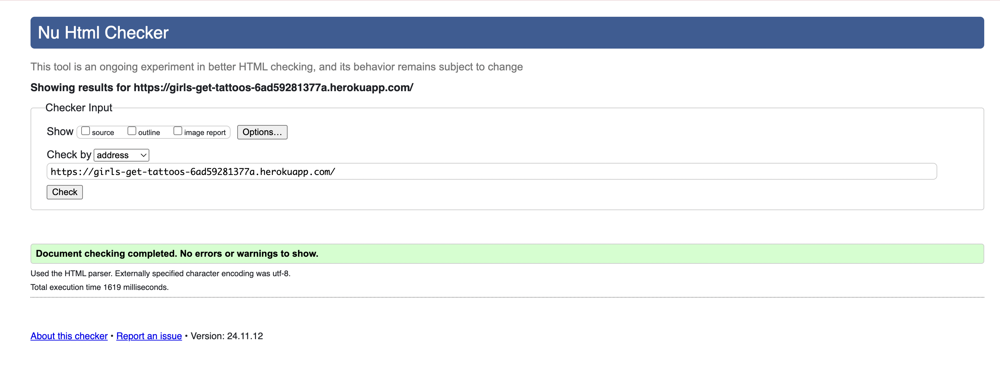
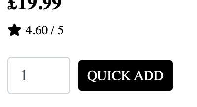
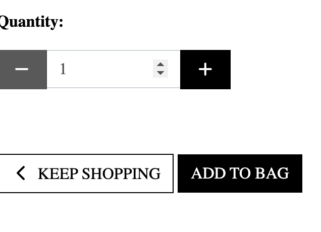
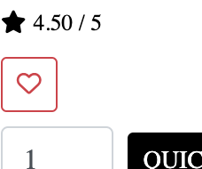
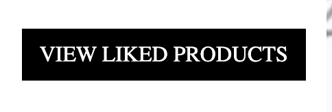

# Testing

## HTML

Click to expand.

- [home.html](https://girls-get-tattoos-6ad59281377a.herokuapp.com/)
  
  
- [signup.html](https://girls-get-tattoos-6ad59281377a.herokuapp.com/accounts/signup/)
  

- [login.html](https://girls-get-tattoos-6ad59281377a.herokuapp.com/accounts/login/)
  

- [products.html](https://girls-get-tattoos-6ad59281377a.herokuapp.com/products/)
  

- [consultations.html](https://girls-get-tattoos-6ad59281377a.herokuapp.com/consultations/)
  

- [contact.html](https://girls-get-tattoos-6ad59281377a.herokuapp.com/contact/)
  

- [bag.html](https://girls-get-tattoos-6ad59281377a.herokuapp.com/bag/)
  

- [reset-password.html](https://girls-get-tattoos-6ad59281377a.herokuapp.com/accounts/password/reset/)
  

- [product_detail.html](https://girls-get-tattoos-6ad59281377a.herokuapp.com/products/1/)
  

- [consultation1.html](https://girls-get-tattoos-6ad59281377a.herokuapp.com/consultations/1/)
  

## CSS

Click to expand.

- I have included only one screenshot as all the pages are linked to the same CSS and all pages load the styles consistently as can be seen in the features.

## JAVASCRIPT

Click to expand.

- JShint
- Here I included all my javascript in one jshint validator image for testing. 

--- 

## PEP8

https://pep8ci.herokuapp.com

---

## Responsiveness 

Click to expand.

- .html

---

## Compatibilty 

The project has been tested for compatibility with the following browsers using this site. You will be able to see there are no issues with the compatability across these browsers:

Click to expand.

- Google Chrome (Version 124)

- Edge (Version 124)

- Firefox (Version 124)

- Safari (Version 17)

- iE (11)

---

## Accessibility

By utilising the Wave Accessibility tool for ongoing development and final testing, used for the below:

1. Ensure all forms have associated labels or appropriate aria-labels.
2. Validate that color contrasts meet the minimum ratios outlined in WCAG 2.1 Contrast Guidelines.
3. Verify correct heading levels to accurately convey content importance.
4. Confirm content is organized within landmarks for ease of use with assistive technology.
5. Provide alternative text or titles for non-textual content.
6. Set the HTML page lang attribute.
7. Implement Aria properties in adherence to best practices outlined in WCAG 2.1.
8. Follow established coding best practices for WCAG 2.1.

---

## Manual Testing 

| Function                      | User Action                                                                 | Outcome                                                                                               | Result |
|------------------------------|-----------------------------------------------------------------------------|------------------------------------------------------------------------------------------------------|--------|
| **Load Home Page**            | Access the Girls Get Tattoos link                                            | The homepage loads with an active navigation system, site branding, and products display.            | Pass   |
| **Load Signup Page**          | From the home page, click on the "Sign Up" link                              | The signup page loads with fields for username, email, password, and a submit button.                | Pass   |
| **Load Login Page**           | From the home page, click on the "Login" link                                | The login page loads with username, password fields and a submit button.                             | Pass   |
| **Browse Products**           | From the navigation, select "Products"                                       | The products page loads with a list of available products, each with an image, name, and price.       | Pass   |
| **View Product Details**      | Click on a product from the "Products" page                                  | The product detail page loads with more information, including a description, price, and images.     | Pass   |
| **Add Product to Bag**        | On the product detail page, click "Add to Bag"                               | The item is added to the shopping bag, and the bag icon in the navigation updates with the count.     | Pass   |
| **View Shopping Bag**         | From the navigation, click on the "Bag" icon                                 | The shopping bag page loads, showing added items with quantity and price details.                    | Pass   |
| **Update Quantity in Bag**    | On the shopping bag page, update the quantity of a product                  | The page refreshes, updating the product quantity and recalculating the total price.                 | Pass   |
| **Remove Product from Bag**   | On the shopping bag page, click the "Remove" button on a product            | The product is removed from the shopping bag, and the page is updated to reflect the change.         | Pass   |
| **Proceed to Checkout**       | On the shopping bag page, click "Proceed to Checkout"                        | The checkout page loads with fields for shipping details, payment options, and a review of the order. | Pass   |
| **Submit Order**              | On the checkout page, fill in the necessary details and submit the order     | The order is placed successfully, and the user is shown a confirmation page with order details.      | Pass   |
| **Contact Us Page**           | From the navigation, click on "Contact"                                      | The contact page loads with a form for users to fill out their name, email, and message.             | Pass   |
| **Consultations Page**        | From the navigation, click on "Consultations"                                | The consultations page loads, displaying available options for users to book a tattoo consultation.  | Pass   |
| **Submit Consultation Request**| On the consultation detail page, select a service and submit the form       | A success message is shown after submitting the consultation request.                                 | Pass   |
| **Forgot Password**           | On the login page, click "Forgot Password"                                   | The password reset page loads, allowing the user to input their email for a password reset.         | Pass   |
| **Login with Correct Credentials**| On the login page, enter correct username and password                  | The user is logged in successfully and redirected to the homepage or their account dashboard.         | Pass   |
| **Logout**                    | After logging in, click the "Logout" link in the navigation                  | The user is logged out and redirected to the login page.                                              | Pass   |
| **View Product in Bag**       | After adding a product to the bag, click on the bag icon                     | The bag icon updates with the product details and total price.                                        | Pass   |
| **View Account Profile**      | After logging in, click on the "Account" link in the navigation              | The user's profile page loads with their personal details, order history, and account settings.      | Pass   |
| **Update Account Details**    | On the profile page, update personal details and save                       | The updated details are saved successfully and displayed on the profile page.                        | Pass   |
| **View Order History**        | On the account profile page, click on "Order History"                        | The order history page loads, showing past orders with their details and statuses.                   | Pass   |

---

## Testing User Story

### Authentication and User Profiles

| User Story | Requirement Met | Image |
| ---------- | ---------------- | ----- |
| As a user, I want to create an account so that I can save my favorite tattoos and view my order history. | Yes |  |
| As a user, I want to log in using my email or social media account so that I can easily access my saved items. | Yes |  |
| As a user, I want to update my profile details (name, email, password) so that my account information is accurate. | Yes |  |
| As an admin, I want to view a list of registered users so that I can manage accounts and view their activities. | Yes |  |

### Shopping & Filtering

| User Story | Requirement Met | Image |
| ---------- | ---------------- | ----- |
| As a customer, I want to filter tattoos by size and style so that I can quickly find designs that match my preferences. | Yes |  |
| As a customer, I want to sort tattoos by price or rating so that I can find options within my budget or the highest-rated designs. | Yes |  |
| As a user, I want to view detailed product information, including pricing and design descriptions so that I can make an informed purchase. | Yes |  |

### Payment and Booking

| User Story | Requirement Met | Image |
| ---------- | ---------------- | ----- |
| As a customer, I want to add products to my cart so that I can purchase multiple items at once. | Yes |   |
| As a customer, I want to securely pay for my tattoo consultation via Stripe so that I can complete my booking without any worries. | Yes |  |
| As a user, I want to book a tattoo appointment based on available slots so that I can reserve a convenient time with an artist. | Yes |  |
| As a user, I want to receive a confirmation email with my appointment details after payment so that I know my booking is confirmed. | Yes |  |

### Consultation Booking

| User Story | Requirement Met | Image |
| ---------- | ---------------- | ----- |
| As a customer, I want to see available dates and times for consultations so that I can select a slot that works for me. | Yes |  |
| As a customer, I want to cancel or reschedule my consultation if my plans change, with an easy-to-use interface. | Yes |  |
| As a user, I want to view my past consultations, including dates, artist details, and feedback, so that I can keep track of my sessions. | Yes |  |

### Wishlist and Likes

| User Story | Requirement Met | Image |
| ---------- | ---------------- | ----- |
| As a user, I want to save my favorite tattoos to a wishlist so that I can easily return to them later. | Yes |  |
| As a user, I want to "like" products in the store so that I can quickly access them from my profile. | Yes |  |
| As a user, I want to view all the products I've liked on a dedicated page so that I can easily browse my favorites. | Yes |  |

### Order History and Tracking

| User Story | Requirement Met | Image |
| ---------- | ---------------- | ----- |
| As a user, I want to view my order history so that I can track my previous purchases and consultations. | Yes |  |

### Admin Management

| User Story | Requirement Met | Image |
| ---------- | ---------------- | ----- |
| As an admin, I want to manage products and consultations in the system so that I can keep the catalog up to date. | Yes |  |
| As an admin, I want to track customer purchases and consultations so that I can offer tailored services and recommendations. | Yes |  |
| As an admin, I want to manage user accounts (approve, deactivate) so that I maintain the security of the platform. | Yes |  |

### SEO & Marketing

| User Story | Requirement Met | Image |
| ---------- | ---------------- | ----- |
| As a user, I want to share tattoo designs and consultations on social media platforms like Instagram so that I can show my choices to friends. | Yes |  |
| As a marketer, I want to optimize the website's SEO using meta tags, sitemaps, and descriptions to ensure it ranks higher on search engines. | Yes |  |
| As a user, I want to subscribe to a newsletter so that I can receive updates about new tattoo designs and promotions. | Yes |  |

### Accessibility

| User Story | Requirement Met | Image |
| ---------- | ---------------- | ----- |
| As a visually impaired user, I want the website to be compatible with screen readers so that I can navigate it easily. | Yes |  |
| As a user, I want to have sufficient contrast in visuals so that the website is easy to read under various lighting conditions. | Yes |  |
| As a user, I want the forms to have clear labels and instructions so that I can easily fill them out without confusion. | Yes |  |

### 404 Error and Custom Pages

| User Story | Requirement Met | Image |
| ---------- | ---------------- | ----- |
| As a user, I want to be shown a custom 404 error page if I navigate to a non-existing page so that my experience isn't disrupted with an unfriendly error. | Yes |  |
| As an admin, I want to update the content on the 404 error page to reflect the website's branding, offering users helpful links to explore other parts of the site. | Yes |  |

---

## Errors

### Google Calendar API Verification

I have set up the Google Cloud Calendar API; however, an error occurs after logging in to Google and clicking the "Book a Consultation" link. The error states that the site has not been verified. 

The verification process for Google Cloud is lengthy, as outlined in [Google's Help Documentation](https://support.google.com/cloud/answer/7454865?hl=en). Unfortunately, due to time constraints during the course, I was unable to complete the verification process.

Despite this, I have tested the functionality by proceeding through the "unsafe" option. While I was able to successfully log in:

I was ultimately unable to proceed further because the site is not verified and cannot be fully trusted by Google. This remains a known issue in the current project implementation.

---

## Lighthouse Report
LightHouse is a web performance testing tool that can be used to evaluate the performance of a website. The report is generated by Google Chrome.

[Lighthouse Report](READMEmedia/lighthouse.png)

---

## Project assessment criteria CHECKLIST. Portfolio 5: Project Submission

Below I have included the criteria needed in order to Pass this Project submission. I have completed each step by putting a **'X'** in each box.

### **1. Design and Build the Application**
- [ **X** ] **Front-End Design**: Ensure the front-end is easy to navigate and allows users to find information intuitively.
- [ **X** ] **Full CRUD Implementation**: Create, read, update, and delete functionalities are fully implemented and visible in the user interface.
- [ **X** ] **Responsive Design**: Ensure the site is fully responsive and follows UX design and accessibility guidelines.

### **2. Robust Codebase**
- [ **X** ] **Code Quality**: Produce a robust codebase with no logic errors.
- [ **X** ] **Data Validation**: Validate all input data effectively.
- [ **X** ] **User Feedback**: Provide users with clear progress indicators and feedback on actions.
- [ **X** ] **API Handling**: Handle APIs effectively with clear error handling.

### **3. Thorough Testing**
- [ **X** ] **Testing Approach**: Demonstrate manual and/or automated testing in the git commits (e.g., JavaScript and Python tests).
- [ **X** ] **Bug-Free Code**: Ensure there are no runtime errors or unexpected behaviours.

### **4. Efficient Configuration**
- [ **X** ] **Procfile**: Maintain an organised and effective `Procfile` for deployment.
- [ **X** ] **Requirements.txt**: Include all necessary dependencies in the `requirements.txt` file.
- [ **X** ] **Settings Files**: Keep configuration and settings files well-organised, with different versions for different branches.
- [ **X** ] **Data Store Configuration**: Centralise data store configuration to a single location for easy changes.

### **5. Documentation**
- [ **X** ] **Data Schema**: Fully describe the data schema in the README file.
- [ **X** ] **Deployment**: Document the deployment process (e.g., Heroku).
- [ **X** ] **Version Control**: Use version control software effectively, providing a detailed record of the development process.

### **6. User Experience**
- [ **X** ] **User Control**: Allow users full control of their interaction with the application.
- [ **X** ] **Purpose Visibility**: Ensure the site’s purpose is immediately evident to a new user without needing supporting documentation.
- [ **X** ] **Meeting Expectations**: Address user demands and expectations effectively.
- [ **X** ] **Large Data Sets**: Provide progress indicators for loading large data sets.

### **7. SEO and Sitemap**
- [ **X** ] **Robots.txt**: Control access to your sitemap using a `robots.txt` file.
- [ **X** ] **Canonical Links**: Ensure all sitemap links are canonical.
- [ **X** ] **Descriptive Metadata**: Use descriptive metadata for SEO, accurately reflecting the site’s purpose.

### **8. Security and Access Control**
- [ **X** ] **Access Control**: Restrict users to intended views and functionalities only.

### **9. Marketing**
- [ **X** ] **Marketing Strategy**: Document the primary marketing strategy behind the application.
- [ **X** ] **Marketing Tools**: Employ relevant marketing strategies and tools.

### **10. Clear Purpose**
- [ **X** ] **Target Audience**: Define and address the needs of a specific target audience (or multiple related audiences).
- [ **X** ] **Clarity of Purpose**: Ensure the solution’s purpose is well-defined and immediately evident.
